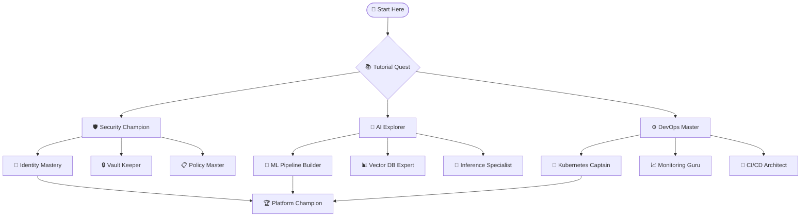
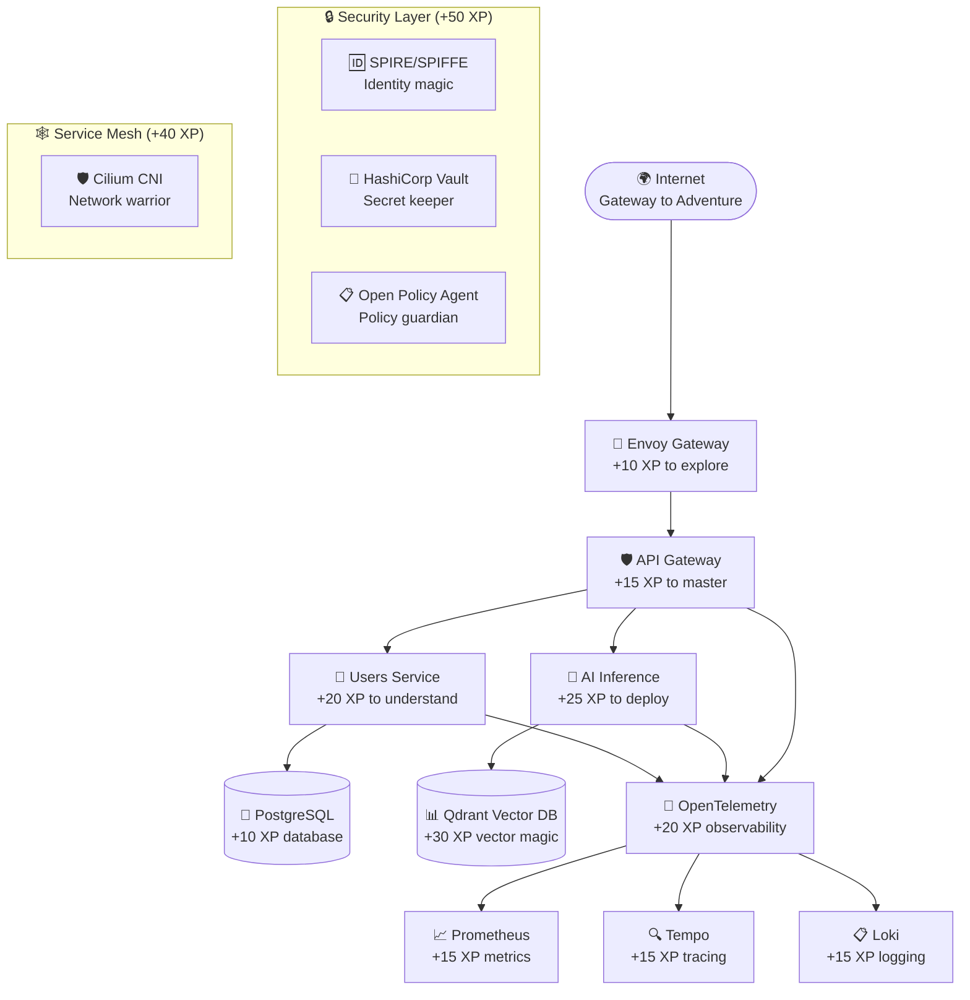
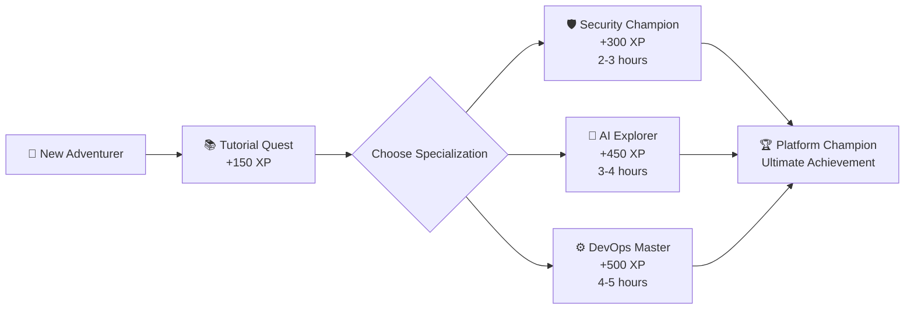

# 🎮 Welcome to Your Enterprise AI Adventure!

**Congratulations, brave adventurer!** You've discovered the **Enterprise AI Platform** - your quest begins now! This production-ready scaffold isn't just documentation... it's your guide through an epic journey of building modern, secure, and scalable AI-driven applications.

## 🏆 Your Adventure Stats
- **Level**: Newcomer 
- **XP**: 0 / 100
- **Achievements Unlocked**: 0 / 42
- **Quests Completed**: 0 / 12

:::tip 🌟 **Did You Know?**
You gain **25 XP** for reading this introduction! Every section you explore awards experience points and unlocks new achievements.
:::

## 🗺️ Your Quest Map

Choose your adventure path and start earning achievements:



## 🚀 Platform Features & Achievements

Unlock features as you progress through your adventure!

:::info 🎮 **Gamified Learning**
Each feature you explore and implement earns you XP and unlocks achievements. Complete quests to become a true platform expert!
:::

### 🏆 Core Achievements Available

- **🔰 Modern Architecture Master**: Cloud-native design with Kubernetes, service mesh, and microservices **(50 XP)**
- **🤖 AI-First Pioneer**: Built-in AI/ML capabilities with inference services, vector databases, and MLOps **(75 XP)**
- **🛡️ Security Champion**: SPIFFE/SPIRE identities, Vault secrets, OPA policies, signed containers **(100 XP)**
- **📊 Observability Expert**: OpenTelemetry tracing, Prometheus metrics, structured logging **(75 XP)**
- **🚀 Production Hero**: Progressive deployments, health checks, SLOs, and disaster recovery **(100 XP)**

### 🗺️ Interactive Architecture Map

Click on components to learn more and earn exploration badges!



## 🛠️ Technology Stack

### Core Infrastructure
- **Container Orchestration**: Kubernetes with Cilium CNI & Service Mesh
- **API Gateway**: Envoy Gateway with Gateway API
- **Service Mesh**: Cilium L7 policies and Hubble observability
- **Identity**: SPIRE for SPIFFE identities and mTLS
- **Secrets**: HashiCorp Vault with External Secrets Operator

### Application Services
- **Languages**: Rust (performance-critical), TypeScript/Node.js (APIs), Python (AI/ML)
- **Frameworks**: Axum/Tonic (Rust), Fastify (Node.js), FastAPI (Python)
- **Communication**: REST APIs + gRPC with OpenTelemetry tracing

### Data & AI
- **Primary Database**: PostgreSQL with connection pooling
- **Caching**: Redis for session/cache data
- **Analytics**: ClickHouse for time-series and analytics
- **Vector Search**: Qdrant for AI embeddings and similarity search
- **Search**: OpenSearch for full-text search
- **AI/ML**: MLflow experiments, Feast feature store, vLLM/Ollama inference

### Observability
- **Tracing**: OpenTelemetry → Tempo/Jaeger
- **Metrics**: Prometheus with Grafana dashboards
- **Logging**: Structured JSON logs → Loki
- **Profiling**: Parca/Pyroscope for continuous profiling
- **Cost**: OpenCost for resource attribution

## 🚀 Start Your Adventure!

Ready to begin? Choose your path and start earning XP!

### 🎯 Quick Start Quest (100 XP)

Follow these steps to complete your first quest:

:::challenge 🏁 **Challenge: First Deployment**
Complete all steps below to earn the **"Quick Starter"** achievement and 100 XP!
:::

#### 📋 Quest Checklist

- [ ] **Tool Check** - Verify all required tools (20 XP)
- [ ] **Repository Setup** - Clone and configure your workspace (20 XP) 
- [ ] **Infrastructure Magic** - Deploy cloud resources (25 XP)
- [ ] **Service Deployment** - Get your services running (25 XP)
- [ ] **Victory Verification** - Confirm everything works (10 XP)

#### 🛠️ Step 1: Adventurer's Toolkit

Ensure your toolkit is ready for the journey:

```bash
# 🔧 Check your adventurer's tools
echo "🔍 Checking required tools..."

# Required spells (tools)
docker --version      # Container magic
make --version        # Build automation
kubectl version      # Kubernetes control
helm version         # Package management
terraform --version  # Infrastructure spells

# Language runtimes (choose your weapons!)
node --version       # JavaScript/TypeScript
go version          # Go language
rustc --version     # Rust language  
python --version    # Python language

echo "✅ Toolkit verified! +20 XP earned!"
```

#### 🏗️ Step 2: Claim Your Territory

```bash
# 🗂️ Set up your development realm
echo "🏰 Claiming your development territory..."

git clone https://github.com/your-org/enterprise-ai-platform
cd enterprise-ai-platform

# Initialize your realm
make init-dev

# Gather resources
make deps

echo "✅ Territory claimed! +20 XP earned!"
```

#### ⚡ Step 3: Cast Infrastructure Spells

```bash
# 🌩️ Deploy cloud infrastructure magic
echo "⚡ Casting infrastructure spells..."

cd infra/terraform/envs/dev
terraform init && terraform apply -auto-approve

# Deploy the platform realm
cd ../../../../
make platform-apply

# Secure your kingdom
make vault-bootstrap
make keycloak-bootstrap

echo "✅ Infrastructure deployed! +25 XP earned!"
```

#### 🚀 Step 4: Awaken Your Services

```bash
# 🛡️ Build and deploy your services
echo "🚀 Awakening platform services..."

# Forge container images
make build

# Deploy to the development realm
make deploy-dev

echo "✅ Services deployed! +25 XP earned!"
```

#### 🎉 Step 5: Victory Check

```bash
# 🏆 Verify your conquest
echo "🎉 Verifying your victory..."

# Check your kingdom's inhabitants
kubectl get pods

# Inspect the gateways
kubectl get gateways

# Test the routes
kubectl get httproutes

# Commune with your services
kubectl port-forward svc/api-gateway 8080:80 &
sleep 5
curl http://localhost:8080/healthz

echo "🏆 Quest Complete! +10 XP earned!"
echo "🎊 Total: 100 XP - Achievement Unlocked: Quick Starter!"
```

## 🗺️ Choose Your Next Adventure

Now that you've completed the Quick Start, which path calls to your adventurous spirit?

### 🚀 Recommended Quest Paths



### 📚 Knowledge Base & Guides

Earn bonus XP by exploring our comprehensive guides:

- **🏗️ [Architecture Deep Dive](./architecture.md)** - Master system design **(+40 XP)**
- **💻 [Development Mastery](./development.md)** - Local workflow expertise **(+30 XP)**
- **🚀 [Production Deployment](./deployment.md)** - Go-live strategies **(+50 XP)**
- **🔒 [Security Fortress](./security.md)** - Advanced security patterns **(+60 XP)**
- **📡 [API Mastery](./api.md)** - REST and gRPC documentation **(+25 XP)**
- **📖 [Operational Runbooks](./runbooks/overview.md)** - Emergency procedures **(+45 XP)**

:::tip 🎯 **Pro Tip: Quest Combinations**
Complete related quests together for bonus XP! For example:
- **Security + DevOps**: +100 bonus XP (Platform Security Expert)
- **AI + Security**: +75 bonus XP (Secure AI Specialist)  
- **All Three**: +200 bonus XP (Platform Grandmaster)
:::

## 🏆 Achievement Showcase

Track your progress and show off your skills:

### 🥉 Bronze Achievements (0-100 XP each)
- 🛠️ **Tool Master** - Set up complete dev environment
- 🏗️ **Foundation Builder** - Deploy infrastructure 
- 🗺️ **Explorer** - Discover all platform components
- 📞 **API Whisperer** - Make your first API calls

### 🥈 Silver Achievements (100-200 XP each)
- 📊 **Metrics Master** - Set up observability
- 🛡️ **Security Guardian** - Implement security features
- 🔄 **Pipeline Builder** - Create CI/CD workflows
- 🧠 **AI Apprentice** - Deploy ML models

### 🥇 Gold Achievements (200+ XP each)
- 🛡️ **Security Champion** - Master enterprise security
- 🤖 **AI Explorer** - Build complete AI systems
- ⚙️ **DevOps Master** - Architect platform operations
- 🏆 **Platform Champion** - Achieve ultimate mastery

## 🎮 Leaderboard & Community

Join thousands of adventurers on their platform journey:

### 🏅 Top Adventurers This Month
1. **Sarah K.** - 2,840 XP - 🏆 Platform Champion
2. **Mike R.** - 2,650 XP - ⚙️ DevOps Master
3. **Lisa M.** - 2,400 XP - 🤖 AI Explorer
4. **Dave T.** - 2,100 XP - 🛡️ Security Champion
5. **You** - ? XP - Ready to climb the ranks?

### 🌟 Community Challenges

- **📅 Monthly Quest**: Complete any quest path this month for +50 bonus XP
- **🏃‍♂️ Speed Run**: Complete Tutorial Quest in under 1 hour for special badge
- **🤝 Team Challenge**: Deploy with a teammate for collaboration badge
- **🔥 Streak Master**: Complete daily learning objectives for 7 days

## 🤝 Contribute & Earn More XP

Help make the platform better and earn exclusive rewards:

:::success 🎊 **Contribution Rewards**
- **📝 Documentation**: +25 XP per improvement
- **🐛 Bug Reports**: +15 XP per valid issue  
- **💡 Feature Ideas**: +30 XP per accepted proposal
- **🔧 Code Contributions**: +50-200 XP per merged PR
- **🎓 Mentoring**: +100 XP for helping other adventurers
:::

### 📋 How to Contribute

1. **Fork & Clone**: Get the codebase
2. **Pick an Issue**: Check our GitHub issues 
3. **Make Changes**: Follow our coding standards
4. **Test Everything**: Ensure quality
5. **Submit PR**: Share your improvements
6. **Earn XP**: Get rewarded for your efforts!

See our [Contributing Guide](./contributing.md) for detailed instructions.

## 🎯 Achievement Tracking

Your journey is tracked automatically! Here's what we monitor:

- **📈 XP Progress**: Every action earns experience
- **🏆 Achievement Unlocks**: Real-time badge earning
- **⏱️ Quest Completion**: Timing and quality metrics  
- **🎯 Skill Development**: Technical competency growth
- **🤝 Community Impact**: Helping others learn

### 🔧 Developer Profile Integration

Add your achievements to your professional profile:

```markdown
## 🏆 Enterprise AI Platform Achievements

🛡️ **Security Champion** - Mastered enterprise security architecture  
🤖 **AI Explorer** - Built production AI/ML systems  
⚙️ **DevOps Master** - Architected scalable platform operations  

**Total XP**: 2,500+ | **Quests Completed**: 12 | **Community Rank**: Top 5%
```

## 🚀 Ready to Begin?

Your platform adventure awaits! Choose your starting point:

- **🆕 New to Platforms?** → [Tutorial Quest](/docs/quests/getting-started)
- **💻 Developer Focus?** → [AI Explorer Quest](/docs/quests/ai-explorer)
- **🔒 Security Minded?** → [Security Champion Quest](/docs/quests/security-champion)  
- **⚙️ Operations Expert?** → [DevOps Master Quest](/docs/quests/devops-master)

:::tip 🎊 **Welcome Bonus**
Start any quest within 24 hours and earn a **+25 XP Welcome Bonus**!
:::

---

## 📄 License & Legal

This project is licensed under the MIT License - see the [LICENSE](../LICENSE) file for details.

**Remember**: Every great platform started with a single deployment. Your adventure begins now! 🚀✨