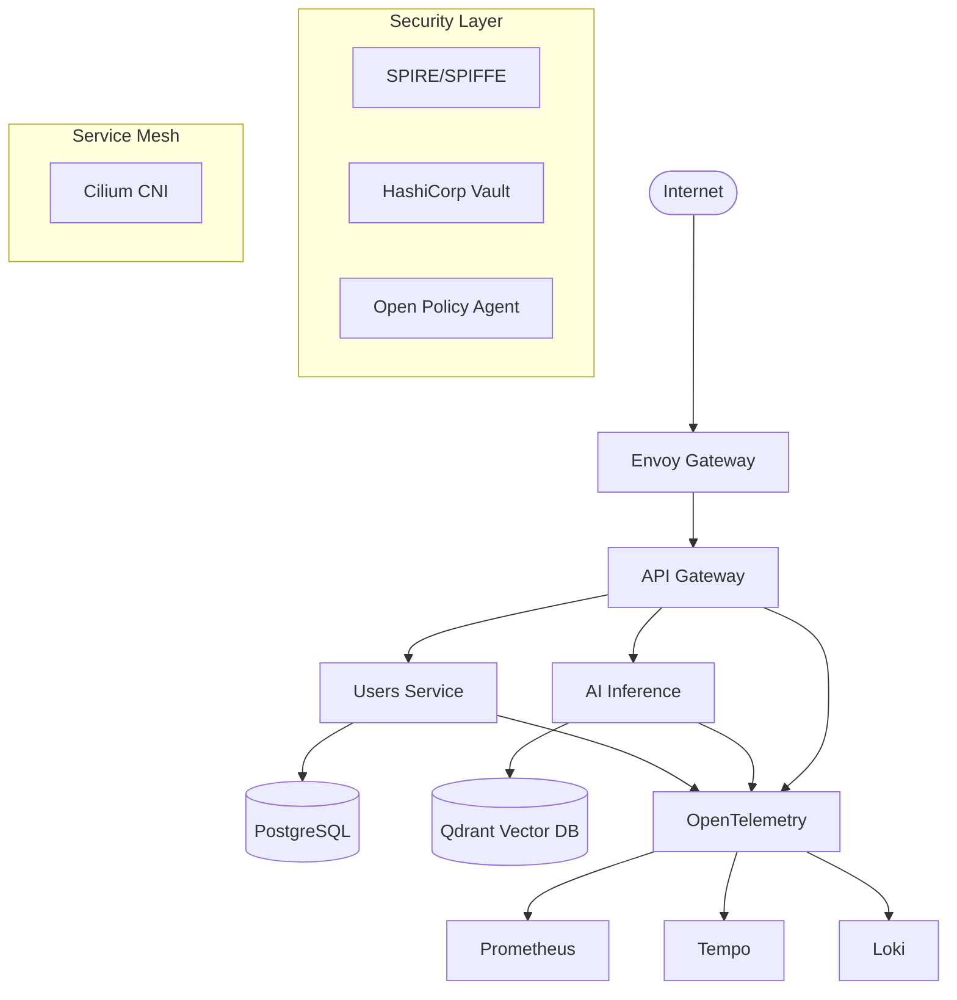

# Welcome to Enterprise AI Platform

The **Enterprise AI Platform** is a production-ready scaffold for building modern, secure, and scalable AI-driven applications. It provides a comprehensive foundation with enterprise-grade security, observability, and operational patterns.

## 🚀 Key Features

- **Modern Architecture**: Cloud-native design with Kubernetes, service mesh, and microservices
- **AI-First**: Built-in AI/ML capabilities with inference services, vector databases, and MLOps
- **Enterprise Security**: SPIFFE/SPIRE identities, Vault secrets, OPA policies, signed containers
- **Full Observability**: OpenTelemetry tracing, Prometheus metrics, structured logging
- **Production Ready**: Progressive deployments, health checks, SLOs, and disaster recovery

## 🏗️ Architecture Overview



## 🛠️ Technology Stack

### Core Infrastructure
- **Container Orchestration**: Kubernetes with Cilium CNI & Service Mesh
- **API Gateway**: Envoy Gateway with Gateway API
- **Service Mesh**: Cilium L7 policies and Hubble observability
- **Identity**: SPIRE for SPIFFE identities and mTLS
- **Secrets**: HashiCorp Vault with External Secrets Operator

### Application Services
- **Languages**: Rust (performance-critical), TypeScript/Node.js (APIs), Python (AI/ML)
- **Frameworks**: Axum/Tonic (Rust), Fastify (Node.js), FastAPI (Python)
- **Communication**: REST APIs + gRPC with OpenTelemetry tracing

### Data & AI
- **Primary Database**: PostgreSQL with connection pooling
- **Caching**: Redis for session/cache data
- **Analytics**: ClickHouse for time-series and analytics
- **Vector Search**: Qdrant for AI embeddings and similarity search
- **Search**: OpenSearch for full-text search
- **AI/ML**: MLflow experiments, Feast feature store, vLLM/Ollama inference

### Observability
- **Tracing**: OpenTelemetry → Tempo/Jaeger
- **Metrics**: Prometheus with Grafana dashboards
- **Logging**: Structured JSON logs → Loki
- **Profiling**: Parca/Pyroscope for continuous profiling
- **Cost**: OpenCost for resource attribution

## 🚦 Quick Start

### Prerequisites

Make sure you have the following tools installed:

```bash
# Required tools
docker, make, kubectl, helm, terraform, cosign, sops, age
# Language runtimes  
node (LTS), go (1.22+), rust (stable), python (3.11+)
```

### 1. Initialize Development Environment

```bash
# Clone the repository
git clone https://github.com/your-org/enterprise-ai-platform
cd enterprise-ai-platform

# Set up development environment
make init-dev

# Install dependencies
make deps
```

### 2. Deploy Infrastructure

```bash
# Deploy cloud infrastructure
cd infra/terraform/envs/dev
terraform init && terraform apply

# Deploy Kubernetes platform
cd ../../../../
make platform-apply

# Configure secrets and identity
make vault-bootstrap
make keycloak-bootstrap
```

### 3. Build and Deploy Services

```bash
# Build container images
make build

# Deploy to development environment
make deploy-dev
```

### 4. Verify Deployment

```bash
# Check service health
kubectl get pods
kubectl get gateways
kubectl get httproutes

# Access services
kubectl port-forward svc/api-gateway 8080:80
curl http://localhost:8080/healthz
```

## 📖 Next Steps

- [Architecture Overview](./architecture.md) - Deep dive into system design
- [Development Guide](./development.md) - Local development workflow
- [Deployment Guide](./deployment.md) - Production deployment
- [Security Model](./security.md) - Security architecture and practices
- [API Reference](./api.md) - REST and gRPC API documentation
- [Runbooks](./runbooks/overview.md) - Operational procedures

## 🤝 Contributing

We welcome contributions! Please see our [Contributing Guide](./contributing.md) for details on:

- Code of conduct
- Development workflow
- Testing requirements
- Documentation standards

## 📄 License

This project is licensed under the MIT License - see the [LICENSE](../LICENSE) file for details.