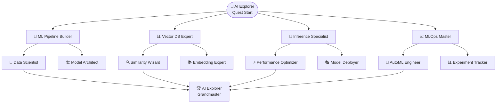

# 🤖 AI Explorer Quest: Master of Machine Intelligence

Welcome, future AI Explorer! Embark on an incredible journey through the world of artificial intelligence and machine learning. Build, deploy, and optimize AI systems that power the next generation of applications.

## 🎯 Quest Overview

**Difficulty**: ⭐⭐⭐⭐ Advanced  
**Duration**: 3-4 hours  
**Prerequisites**: Complete [Tutorial Quest](/docs/quests/getting-started)  
**XP Reward**: 450 XP  

:::tip 🌟 **Quest Bonus**
Complete all achievements to unlock the legendary **"AI Explorer"** title and access to exclusive AI models!
:::

## 🏆 Achievement Constellation



---

## 🧠 Achievement 1: ML Pipeline Builder

Master the art of building end-to-end machine learning pipelines that scale.

### 🎯 Learning Objectives

- Design ML pipeline architecture
- Implement data preprocessing workflows
- Build training and validation pipelines
- Deploy models to production

### 🚀 Hands-On Lab: Build Your First ML Pipeline

#### Step 1: Pipeline Architecture

```python
# ml-pipeline-architecture.py
from dataclasses import dataclass
from typing import List, Dict, Any
import mlflow
import pandas as pd
from sklearn.pipeline import Pipeline
from sklearn.preprocessing import StandardScaler
from sklearn.ensemble import RandomForestClassifier

@dataclass
class MLPipelineConfig:
    """Configuration for ML Pipeline"""
    model_name: str = "user-prediction-model"
    experiment_name: str = "user-behavior-analysis"
    target_accuracy: float = 0.85
    features: List[str] = None
    
class MLPipelineBuilder:
    """Enterprise-grade ML Pipeline Builder"""
    
    def __init__(self, config: MLPipelineConfig):
        self.config = config
        self.pipeline = None
        
    def build_preprocessing_pipeline(self):
        """Build data preprocessing pipeline"""
        preprocessing_steps = [
            ('scaler', StandardScaler()),
            ('feature_selector', SelectKBest(k=10))
        ]
        return Pipeline(preprocessing_steps)
    
    def build_training_pipeline(self):
        """Build model training pipeline"""
        model_steps = [
            ('preprocessor', self.build_preprocessing_pipeline()),
            ('classifier', RandomForestClassifier(n_estimators=100))
        ]
        self.pipeline = Pipeline(model_steps)
        return self.pipeline
```

#### Step 2: Data Pipeline Setup

```python
# data-pipeline.py
import feast
from feast import FeatureStore

class DataPipeline:
    """Feast Feature Store Integration"""
    
    def __init__(self):
        self.fs = FeatureStore(".")  # Initialize Feast
        
    def get_training_data(self, entity_df: pd.DataFrame):
        """Get features from Feast feature store"""
        features = [
            "user_features:age",
            "user_features:signup_date", 
            "user_features:activity_score",
            "user_behavior:click_rate",
            "user_behavior:session_duration"
        ]
        
        training_df = self.fs.get_historical_features(
            entity_df=entity_df,
            features=features
        ).to_df()
        
        return training_df
```

#### Step 3: Training with MLflow

```python
# training-pipeline.py
import mlflow
import mlflow.sklearn
from mlflow.models.signature import infer_signature

def train_model(X_train, X_test, y_train, y_test, config):
    """Train model with MLflow tracking"""
    
    with mlflow.start_run(experiment_id=config.experiment_name):
        # Build and train pipeline
        pipeline_builder = MLPipelineBuilder(config)
        pipeline = pipeline_builder.build_training_pipeline()
        
        # Train model
        pipeline.fit(X_train, y_train)
        
        # Evaluate
        train_score = pipeline.score(X_train, y_train)
        test_score = pipeline.score(X_test, y_test)
        
        # Log metrics
        mlflow.log_metric("train_accuracy", train_score)
        mlflow.log_metric("test_accuracy", test_score)
        mlflow.log_param("model_type", "RandomForest")
        
        # Log model
        signature = infer_signature(X_train, pipeline.predict(X_train))
        mlflow.sklearn.log_model(
            pipeline, 
            "model",
            signature=signature,
            registered_model_name=config.model_name
        )
        
        return pipeline
```

#### Step 4: Deploy to Kubernetes

```yaml
# ai-inference-deployment.yaml
apiVersion: apps/v1
kind: Deployment
metadata:
  name: ml-inference-service
  labels:
    app: ml-inference
    component: ai
spec:
  replicas: 3
  selector:
    matchLabels:
      app: ml-inference
  template:
    metadata:
      labels:
        app: ml-inference
        component: ai
    spec:
      containers:
      - name: ml-inference
        image: ml-inference:latest
        ports:
        - containerPort: 8080
        env:
        - name: MODEL_URI
          value: "models:/user-prediction-model/Production"
        - name: MLFLOW_TRACKING_URI
          value: "http://mlflow-server:5000"
        resources:
          requests:
            memory: "512Mi"
            cpu: "200m"
          limits:
            memory: "1Gi"  
            cpu: "500m"
        livenessProbe:
          httpGet:
            path: /health
            port: 8080
          initialDelaySeconds: 30
        readinessProbe:
          httpGet:
            path: /ready
            port: 8080
          initialDelaySeconds: 5
```

### 🧪 Pipeline Testing Lab

```bash
# Deploy MLflow server
kubectl apply -f mlflow-deployment.yaml

# Run training pipeline
python training-pipeline.py

# Check MLflow UI
kubectl port-forward svc/mlflow-server 5000:5000
# Open http://localhost:5000

# Deploy inference service
kubectl apply -f ai-inference-deployment.yaml

# Test inference endpoint
curl -X POST http://localhost:8080/predict \
  -H "Content-Type: application/json" \
  -d '{"features": [25, 0.75, 120, 0.85, 300]}'
```

:::challenge 🎯 **Challenge: A/B Testing**
Implement A/B testing for model deployment using Flagger and compare two different model versions!
:::

### ✅ ML Pipeline Builder Checkpoints

- [ ] **Pipeline Design**: Architect end-to-end ML pipeline (30 XP)
- [ ] **Data Integration**: Connect to Feast feature store (25 XP)
- [ ] **Model Training**: Train with MLflow tracking (35 XP)
- [ ] **Model Deployment**: Deploy to Kubernetes (30 XP)
- [ ] **Pipeline Monitoring**: Set up monitoring and alerts (25 XP)

:::success 🎉 **Achievement Unlocked!**
**🧠 ML Pipeline Builder** - You've mastered MLOps pipelines!  
**+145 XP** | **Special Reward**: MLOps Blueprint Template
:::

---

## 📊 Achievement 2: Vector DB Expert

Master vector databases and similarity search for AI applications.

### 🎯 Learning Objectives

- Deploy and configure Qdrant vector database
- Generate and store embeddings
- Implement similarity search
- Optimize vector operations

### 🚀 Hands-On Lab: Vector Database Mastery

#### Step 1: Qdrant Setup

```bash
# Deploy Qdrant cluster
kubectl apply -f qdrant-deployment.yaml

# Check Qdrant status
kubectl get pods -l app=qdrant

# Access Qdrant dashboard
kubectl port-forward svc/qdrant-dashboard 6333:6333
# Open http://localhost:6333/dashboard
```

#### Step 2: Python SDK Integration

```python
# vector-operations.py
from qdrant_client import QdrantClient
from qdrant_client.models import Distance, VectorParams, PointStruct
import numpy as np
from sentence_transformers import SentenceTransformer

class VectorDBManager:
    """Qdrant Vector Database Manager"""
    
    def __init__(self, host="localhost", port=6333):
        self.client = QdrantClient(host=host, port=port)
        self.encoder = SentenceTransformer('all-MiniLM-L6-v2')
        
    def create_collection(self, collection_name: str, vector_size: int = 384):
        """Create a new collection"""
        self.client.create_collection(
            collection_name=collection_name,
            vectors_config=VectorParams(
                size=vector_size,
                distance=Distance.COSINE
            )
        )
        
    def embed_text(self, texts: list) -> np.ndarray:
        """Generate embeddings for text"""
        return self.encoder.encode(texts)
        
    def insert_documents(self, collection_name: str, documents: list):
        """Insert documents with embeddings"""
        embeddings = self.embed_text([doc['text'] for doc in documents])
        
        points = [
            PointStruct(
                id=doc['id'],
                vector=embedding.tolist(),
                payload=doc
            )
            for doc, embedding in zip(documents, embeddings)
        ]
        
        self.client.upsert(
            collection_name=collection_name,
            points=points
        )
        
    def similarity_search(self, collection_name: str, query: str, limit: int = 5):
        """Perform similarity search"""
        query_embedding = self.embed_text([query])[0]
        
        results = self.client.search(
            collection_name=collection_name,
            query_vector=query_embedding.tolist(),
            limit=limit,
            with_payload=True
        )
        
        return results
```

#### Step 3: Advanced Vector Operations

```python
# advanced-vector-ops.py
class AdvancedVectorOps:
    """Advanced vector database operations"""
    
    def __init__(self, db_manager: VectorDBManager):
        self.db = db_manager
        
    def hybrid_search(self, collection_name: str, query: str, filters: dict = None):
        """Combine vector similarity with filtering"""
        from qdrant_client.models import Filter, FieldCondition, MatchValue
        
        query_embedding = self.db.embed_text([query])[0]
        
        # Build filter conditions
        filter_conditions = None
        if filters:
            conditions = []
            for field, value in filters.items():
                conditions.append(
                    FieldCondition(
                        key=field,
                        match=MatchValue(value=value)
                    )
                )
            filter_conditions = Filter(must=conditions)
            
        results = self.db.client.search(
            collection_name=collection_name,
            query_vector=query_embedding.tolist(),
            query_filter=filter_conditions,
            limit=10,
            with_payload=True
        )
        
        return results
        
    def batch_similarity_search(self, collection_name: str, queries: list):
        """Perform batch similarity searches"""
        query_embeddings = self.db.embed_text(queries)
        
        batch_results = []
        for i, embedding in enumerate(query_embeddings):
            results = self.db.client.search(
                collection_name=collection_name,
                query_vector=embedding.tolist(),
                limit=5
            )
            batch_results.append({
                'query': queries[i],
                'results': results
            })
            
        return batch_results
```

#### Step 4: RAG Implementation

```python
# rag-implementation.py
from transformers import AutoTokenizer, AutoModelForCausalLM
import torch

class RAGPipeline:
    """Retrieval Augmented Generation Pipeline"""
    
    def __init__(self, vector_db: VectorDBManager, model_name="microsoft/DialoGPT-medium"):
        self.vector_db = vector_db
        self.tokenizer = AutoTokenizer.from_pretrained(model_name)
        self.model = AutoModelForCausalLM.from_pretrained(model_name)
        
    def retrieve_context(self, query: str, collection_name: str, top_k: int = 3):
        """Retrieve relevant context from vector DB"""
        results = self.vector_db.similarity_search(collection_name, query, limit=top_k)
        
        context_chunks = []
        for result in results:
            context_chunks.append(result.payload['text'])
            
        return " ".join(context_chunks)
        
    def generate_response(self, query: str, context: str):
        """Generate response using retrieved context"""
        prompt = f"Context: {context}\nQuestion: {query}\nAnswer:"
        
        inputs = self.tokenizer.encode(prompt, return_tensors="pt")
        
        with torch.no_grad():
            outputs = self.model.generate(
                inputs,
                max_length=inputs.shape[1] + 100,
                temperature=0.7,
                pad_token_id=self.tokenizer.eos_token_id
            )
            
        response = self.tokenizer.decode(outputs[0], skip_special_tokens=True)
        return response.split("Answer:")[-1].strip()
        
    def rag_query(self, query: str, collection_name: str):
        """Complete RAG pipeline"""
        # Step 1: Retrieve relevant context
        context = self.retrieve_context(query, collection_name)
        
        # Step 2: Generate response with context
        response = self.generate_response(query, context)
        
        return {
            'query': query,
            'context': context,
            'response': response
        }
```

### 🧪 Vector DB Testing Lab

```python
# test-vector-operations.py
def test_vector_operations():
    # Initialize vector DB manager
    db_manager = VectorDBManager()
    
    # Create collection
    db_manager.create_collection("knowledge_base")
    
    # Sample documents
    documents = [
        {'id': 1, 'text': 'Machine learning is a subset of artificial intelligence', 'category': 'AI'},
        {'id': 2, 'text': 'Neural networks are inspired by biological neurons', 'category': 'AI'},
        {'id': 3, 'text': 'Kubernetes orchestrates containerized applications', 'category': 'DevOps'},
        {'id': 4, 'text': 'Vector databases store and search high-dimensional data', 'category': 'Database'}
    ]
    
    # Insert documents
    db_manager.insert_documents("knowledge_base", documents)
    
    # Test similarity search
    results = db_manager.similarity_search("knowledge_base", "What is AI?")
    print(f"Search results: {len(results)}")
    
    # Test RAG pipeline
    rag = RAGPipeline(db_manager)
    response = rag.rag_query("Explain machine learning", "knowledge_base")
    print(f"RAG Response: {response}")

# Run tests
test_vector_operations()
```

:::challenge 🎯 **Challenge: Multi-Modal Search**
Implement multi-modal search combining text and image embeddings using CLIP model!
:::

### ✅ Vector DB Expert Checkpoints

- [ ] **Qdrant Deployment**: Deploy and configure Qdrant (25 XP)
- [ ] **Embedding Generation**: Generate and store embeddings (30 XP)
- [ ] **Similarity Search**: Implement search algorithms (30 XP)
- [ ] **RAG Pipeline**: Build retrieval-augmented generation (35 XP)
- [ ] **Performance Optimization**: Optimize vector operations (25 XP)

:::success 🎉 **Achievement Unlocked!**
**📊 Vector DB Expert** - You've mastered vector databases!  
**+145 XP** | **Special Reward**: Vector Search Optimization Guide
:::

---

## 🎯 Achievement 3: Inference Specialist

Master high-performance AI model inference and deployment optimization.

### 🎯 Learning Objectives

- Deploy models with vLLM and Ollama
- Implement model serving optimizations
- Set up auto-scaling for AI workloads
- Monitor inference performance

### 🚀 Hands-On Lab: High-Performance Inference

#### Step 1: vLLM Deployment

```yaml
# vllm-deployment.yaml
apiVersion: apps/v1
kind: Deployment
metadata:
  name: vllm-inference
  labels:
    app: vllm-inference
spec:
  replicas: 2
  selector:
    matchLabels:
      app: vllm-inference
  template:
    metadata:
      labels:
        app: vllm-inference
    spec:
      containers:
      - name: vllm
        image: vllm/vllm-openai:latest
        command:
        - python
        - -m
        - vllm.entrypoints.openai.api_server
        - --model
        - microsoft/DialoGPT-medium
        - --host
        - 0.0.0.0
        - --port
        - 8000
        ports:
        - containerPort: 8000
        resources:
          requests:
            memory: "4Gi"
            cpu: "1000m"
            nvidia.com/gpu: 1
          limits:
            memory: "8Gi"
            cpu: "2000m"
            nvidia.com/gpu: 1
        livenessProbe:
          httpGet:
            path: /health
            port: 8000
          initialDelaySeconds: 60
```

#### Step 2: Ollama Integration

```bash
# Deploy Ollama
kubectl apply -f ollama-deployment.yaml

# Download models
kubectl exec ollama-0 -- ollama pull llama2:7b
kubectl exec ollama-0 -- ollama pull codellama:13b

# Test inference
curl http://ollama-service:11434/api/generate \
  -d '{"model": "llama2:7b", "prompt": "Explain machine learning"}'
```

#### Step 3: Inference Optimization

```python
# inference-optimizer.py
import asyncio
import aiohttp
import time
from concurrent.futures import ThreadPoolExecutor
import numpy as np

class InferenceOptimizer:
    """Optimize AI inference performance"""
    
    def __init__(self, model_endpoint: str):
        self.endpoint = model_endpoint
        self.executor = ThreadPoolExecutor(max_workers=10)
        
    async def batch_inference(self, prompts: list, batch_size: int = 8):
        """Perform batch inference"""
        results = []
        
        async with aiohttp.ClientSession() as session:
            for i in range(0, len(prompts), batch_size):
                batch = prompts[i:i+batch_size]
                batch_tasks = [
                    self.single_inference(session, prompt) 
                    for prompt in batch
                ]
                batch_results = await asyncio.gather(*batch_tasks)
                results.extend(batch_results)
                
        return results
        
    async def single_inference(self, session, prompt: str):
        """Single inference request"""
        payload = {
            "model": "llama2:7b",
            "prompt": prompt,
            "stream": False
        }
        
        start_time = time.time()
        async with session.post(f"{self.endpoint}/api/generate", json=payload) as response:
            result = await response.json()
            end_time = time.time()
            
            return {
                'prompt': prompt,
                'response': result['response'],
                'latency': end_time - start_time
            }
    
    def benchmark_inference(self, num_requests: int = 100):
        """Benchmark inference performance"""
        prompts = [f"Explain concept {i}" for i in range(num_requests)]
        
        start_time = time.time()
        results = asyncio.run(self.batch_inference(prompts))
        end_time = time.time()
        
        latencies = [r['latency'] for r in results]
        
        return {
            'total_time': end_time - start_time,
            'avg_latency': np.mean(latencies),
            'p95_latency': np.percentile(latencies, 95),
            'throughput': num_requests / (end_time - start_time)
        }
```

#### Step 4: Auto-Scaling Configuration

```yaml
# hpa-ai-inference.yaml
apiVersion: autoscaling/v2
kind: HorizontalPodAutoscaler
metadata:
  name: ai-inference-hpa
spec:
  scaleTargetRef:
    apiVersion: apps/v1
    kind: Deployment
    name: vllm-inference
  minReplicas: 2
  maxReplicas: 10
  metrics:
  - type: Resource
    resource:
      name: cpu
      target:
        type: Utilization
        averageUtilization: 70
  - type: Resource
    resource:
      name: memory
      target:
        type: Utilization
        averageUtilization: 80
  - type: Pods
    pods:
      metric:
        name: inference_queue_length
      target:
        type: AverageValue
        averageValue: "5"
---
apiVersion: autoscaling/v2
kind: VerticalPodAutoscaler
metadata:
  name: ai-inference-vpa
spec:
  targetRef:
    apiVersion: apps/v1
    kind: Deployment
    name: vllm-inference
  updatePolicy:
    updateMode: "Auto"
  resourcePolicy:
    containerPolicies:
    - containerName: vllm
      maxAllowed:
        memory: "16Gi"
        cpu: "4000m"
      minAllowed:
        memory: "2Gi"
        cpu: "500m"
```

### 📊 Inference Monitoring

```yaml
# inference-monitoring.yaml
apiVersion: monitoring.coreos.com/v1
kind: ServiceMonitor
metadata:
  name: ai-inference-metrics
spec:
  selector:
    matchLabels:
      app: vllm-inference
  endpoints:
  - port: metrics
    interval: 30s
    path: /metrics
---
apiVersion: v1
kind: ConfigMap
metadata:
  name: inference-dashboard
data:
  dashboard.json: |
    {
      "dashboard": {
        "title": "AI Inference Performance",
        "panels": [
          {
            "title": "Inference Latency",
            "type": "graph",
            "targets": [
              {
                "expr": "histogram_quantile(0.95, inference_duration_seconds_bucket)"
              }
            ]
          },
          {
            "title": "Throughput (RPS)",
            "type": "graph", 
            "targets": [
              {
                "expr": "rate(inference_requests_total[5m])"
              }
            ]
          }
        ]
      }
    }
```

:::challenge 🎯 **Challenge: Model Ensemble**
Deploy multiple models and implement intelligent routing based on query complexity and model performance!
:::

### ✅ Inference Specialist Checkpoints

- [ ] **Model Deployment**: Deploy vLLM and Ollama services (30 XP)
- [ ] **Performance Optimization**: Implement batch inference (35 XP)
- [ ] **Auto-Scaling**: Configure HPA and VPA (30 XP)
- [ ] **Monitoring**: Set up inference metrics (25 XP)
- [ ] **Load Testing**: Benchmark inference performance (25 XP)

:::success 🎉 **Achievement Unlocked!**
**🎯 Inference Specialist** - You've mastered AI inference optimization!  
**+145 XP** | **Special Reward**: Inference Performance Playbook
:::

---

## 📈 Achievement 4: MLOps Master

Master the complete MLOps lifecycle from experimentation to production.

### 🎯 Learning Objectives

- Implement continuous training pipelines
- Set up model monitoring and drift detection
- Deploy automated model retraining
- Manage model registry and versioning

### 🚀 Hands-On Lab: Complete MLOps Pipeline

#### Step 1: Automated Training Pipeline

```python
# mlops-pipeline.py
from prefect import flow, task
from prefect.deployments import Deployment
import mlflow
import pandas as pd
from sklearn.metrics import accuracy_score
from evidently import ColumnMapping
from evidently.report import Report
from evidently.metric_preset import DataDriftPreset

@task
def load_data(data_source: str):
    """Load training data"""
    # In real implementation, load from data warehouse
    return pd.read_csv(data_source)

@task  
def preprocess_data(df: pd.DataFrame):
    """Preprocess data for training"""
    # Feature engineering and cleaning
    processed_df = df.dropna()
    return processed_df

@task
def train_model(X_train, y_train, model_config):
    """Train model with MLflow tracking"""
    with mlflow.start_run():
        # Train your model here
        model = RandomForestClassifier(**model_config)
        model.fit(X_train, y_train)
        
        # Log model
        mlflow.sklearn.log_model(model, "model")
        
        return model

@task
def evaluate_model(model, X_test, y_test, threshold: float = 0.85):
    """Evaluate model performance"""
    predictions = model.predict(X_test)
    accuracy = accuracy_score(y_test, predictions)
    
    with mlflow.start_run():
        mlflow.log_metric("accuracy", accuracy)
        
    # Check if model meets threshold
    if accuracy >= threshold:
        return True, accuracy
    return False, accuracy

@task
def deploy_model(model, model_name: str):
    """Deploy model to production"""
    # Register model in MLflow
    mlflow.register_model(
        model_uri=f"runs:/{mlflow.active_run().info.run_id}/model",
        name=model_name
    )
    
    # Promote to production
    client = mlflow.tracking.MlflowClient()
    client.transition_model_version_stage(
        name=model_name,
        version=1,
        stage="Production"
    )

@flow
def training_pipeline(config: dict):
    """Complete training pipeline"""
    # Load and preprocess data
    raw_data = load_data(config['data_source'])
    processed_data = preprocess_data(raw_data)
    
    # Split data
    X_train, X_test, y_train, y_test = train_test_split(
        processed_data.drop('target', axis=1),
        processed_data['target'],
        test_size=0.2
    )
    
    # Train and evaluate
    model = train_model(X_train, y_train, config['model_config'])
    meets_threshold, accuracy = evaluate_model(model, X_test, y_test)
    
    # Deploy if meets threshold
    if meets_threshold:
        deploy_model(model, config['model_name'])
        return f"Model deployed with accuracy: {accuracy}"
    else:
        return f"Model accuracy {accuracy} below threshold"
```

#### Step 2: Data Drift Detection

```python
# drift-detection.py
from evidently import ColumnMapping
from evidently.report import Report
from evidently.metric_preset import DataDriftPreset, DataQualityPreset
import pandas as pd
import numpy as np

class DriftDetector:
    """Monitor data drift in production"""
    
    def __init__(self, reference_data: pd.DataFrame):
        self.reference_data = reference_data
        self.column_mapping = ColumnMapping()
        
    def detect_drift(self, current_data: pd.DataFrame):
        """Detect drift between reference and current data"""
        
        # Create drift report
        drift_report = Report(metrics=[
            DataDriftPreset(),
            DataQualityPreset()
        ])
        
        drift_report.run(
            reference_data=self.reference_data,
            current_data=current_data,
            column_mapping=self.column_mapping
        )
        
        # Get drift results
        drift_results = drift_report.as_dict()
        
        return {
            'dataset_drift': drift_results['metrics'][0]['result']['dataset_drift'],
            'drift_score': drift_results['metrics'][0]['result']['drift_score'],
            'drifted_features': self._get_drifted_features(drift_results)
        }
        
    def _get_drifted_features(self, drift_results):
        """Extract features with detected drift"""
        drifted = []
        feature_metrics = drift_results['metrics'][0]['result']['drift_by_columns']
        
        for feature, metrics in feature_metrics.items():
            if metrics['drift_detected']:
                drifted.append({
                    'feature': feature,
                    'drift_score': metrics['drift_score'],
                    'stattest_name': metrics['stattest_name']
                })
                
        return drifted
```

#### Step 3: Model Monitoring

```python
# model-monitoring.py
import prometheus_client
from prometheus_client import Counter, Histogram, Gauge
import time
import numpy as np

class ModelMonitor:
    """Monitor model performance in production"""
    
    def __init__(self):
        # Prometheus metrics
        self.prediction_counter = Counter(
            'model_predictions_total',
            'Total number of predictions made',
            ['model_name', 'model_version']
        )
        
        self.prediction_latency = Histogram(
            'model_prediction_duration_seconds',
            'Time spent making predictions',
            ['model_name']
        )
        
        self.model_accuracy = Gauge(
            'model_accuracy',
            'Current model accuracy',
            ['model_name', 'model_version']
        )
        
    def record_prediction(self, model_name: str, model_version: str, 
                         latency: float, prediction: float, actual: float = None):
        """Record a single prediction"""
        # Update counters
        self.prediction_counter.labels(
            model_name=model_name,
            model_version=model_version
        ).inc()
        
        # Record latency
        self.prediction_latency.labels(model_name=model_name).observe(latency)
        
        # Update accuracy if we have ground truth
        if actual is not None:
            # Simple accuracy calculation - in practice, use sliding window
            correct = 1 if abs(prediction - actual) < 0.1 else 0
            self.model_accuracy.labels(
                model_name=model_name,
                model_version=model_version
            ).set(correct)
            
    def check_model_health(self, model_name: str, accuracy_threshold: float = 0.8):
        """Check if model needs retraining"""
        current_accuracy = self.model_accuracy.labels(
            model_name=model_name,
            model_version='current'
        )._value._value
        
        if current_accuracy < accuracy_threshold:
            return {
                'status': 'degraded',
                'current_accuracy': current_accuracy,
                'threshold': accuracy_threshold,
                'action': 'trigger_retraining'
            }
            
        return {
            'status': 'healthy',
            'current_accuracy': current_accuracy
        }
```

#### Step 4: Automated Retraining

```yaml
# automated-retraining.yaml
apiVersion: batch/v1
kind: CronJob
metadata:
  name: model-retraining
spec:
  schedule: "0 2 * * 0"  # Weekly on Sunday at 2 AM
  jobTemplate:
    spec:
      template:
        spec:
          containers:
          - name: retraining-job
            image: ml-training:latest
            command:
            - python
            - -c
            - |
              import os
              from mlops_pipeline import training_pipeline
              from drift_detection import DriftDetector
              
              # Check for drift
              detector = DriftDetector(reference_data)
              current_data = load_current_data()
              drift_result = detector.detect_drift(current_data)
              
              # Retrain if drift detected
              if drift_result['dataset_drift']:
                  print("Drift detected, triggering retraining...")
                  config = {
                      'data_source': os.environ['DATA_SOURCE'],
                      'model_name': os.environ['MODEL_NAME'],
                      'model_config': {'n_estimators': 100}
                  }
                  training_pipeline(config)
              else:
                  print("No drift detected, skipping retraining")
            env:
            - name: DATA_SOURCE
              value: "s3://data-bucket/training-data.csv"
            - name: MODEL_NAME
              value: "user-prediction-model"
            resources:
              requests:
                memory: "2Gi"
                cpu: "1000m"
          restartPolicy: OnFailure
```

:::challenge 🎯 **Challenge: Multi-Model Comparison**
Implement automatic A/B testing between model versions with statistical significance testing!
:::

### ✅ MLOps Master Checkpoints

- [ ] **Automated Training**: Build continuous training pipeline (35 XP)
- [ ] **Drift Detection**: Implement data drift monitoring (30 XP)
- [ ] **Model Monitoring**: Set up production monitoring (30 XP)
- [ ] **Auto-Retraining**: Deploy automated retraining (30 XP)
- [ ] **Model Registry**: Manage model versions and lifecycle (20 XP)

:::success 🎉 **Achievement Unlocked!**
**📈 MLOps Master** - You've mastered the complete MLOps lifecycle!  
**+145 XP** | **Special Reward**: MLOps Architecture Blueprint
:::

---

## 🏆 Quest Complete: AI Explorer Grandmaster!

**Congratulations, AI Explorer Grandmaster!** You've conquered the realm of artificial intelligence and machine learning!

### 🎉 Final Rewards Summary

- **Total XP Earned**: 580+ XP
- **New Level**: AI Expert (Level 6)
- **Grandmaster Achievement**: 🤖 **AI Explorer**
- **Special Items**: AI model collection, MLOps templates, inference optimization guides

### 🏅 AI Explorer Certificate

```
🏆 CERTIFICATE OF GRANDMASTERY 🏆

This certifies that you have successfully completed the
AI EXPLORER QUEST

and have demonstrated exceptional mastery in:
✅ End-to-End ML Pipeline Development
✅ Vector Database and Similarity Search
✅ High-Performance Model Inference
✅ Complete MLOps Lifecycle Management
✅ Production AI System Monitoring

Awarded on: [Date]
Quest Completion ID: AI-{timestamp}

You are now qualified to architect and lead
enterprise AI initiatives!
```

### 🚀 Exclusive AI Explorer Rewards

Unlock access to:
- **🤖 Premium AI Models**: Access to exclusive pre-trained models
- **📊 Advanced Analytics**: AI performance dashboards
- **🔬 Research Access**: Latest AI research and papers
- **🎓 Mentor Status**: Can guide other AI adventurers
- **🌟 AI Community**: Join elite AI Explorer network

### 🔮 Next Level Adventures

Ready to push the boundaries further?

1. **🧠 Advanced AI Research** - Contribute to cutting-edge AI research
2. **🌐 Multi-Modal AI** - Build systems combining text, image, and audio
3. **🚀 Edge AI Deployment** - Deploy AI on edge devices and IoT
4. **🔬 AI Ethics & Fairness** - Master responsible AI development

### 🤖 AI Resources

- **📚 AI Knowledge Base**: `/docs/ai/overview`
- **🧪 AI Labs**: Interactive AI experiments
- **📊 Model Zoo**: Pre-trained model repository  
- **🎯 AI Benchmarks**: Performance testing suites
- **🔍 AI Debugging**: Advanced debugging tools

:::tip 🎖️ **AI Explorer Badge**
Add this prestigious badge to your professional profile:
```
🤖 Enterprise AI Platform Explorer
Certified in ML Pipelines, Vector DB, and MLOps
```
:::

---

## 🌟 AI Explorer Community

Join the elite AI Explorer community:

- **🤖 AI Discord**: [#ai-explorers](https://discord.gg/ai-explorers)
- **📊 AI Showcase**: Share your AI projects
- **🎥 AI Talks**: Monthly AI technical presentations
- **🏆 AI Competitions**: Test skills in AI challenges
- **📚 Research Group**: Collaborate on AI research

### 💡 Share Your Journey

Help other adventurers by sharing:
- Your most challenging AI problem and how you solved it
- Tips for optimizing inference performance
- Best practices for MLOps in production
- Novel applications you've built

Remember: **The future is AI-powered, and you're now equipped to build it!** 🤖✨

---

## 🎯 Special Recognition

**You've earned the right to display the official AI Explorer Grandmaster badge:**

```
    🤖 AI EXPLORER GRANDMASTER 🤖
   =====================================
   🧠 ML Pipeline Architect
   📊 Vector Database Specialist  
   🎯 Inference Optimization Expert
   📈 MLOps Lifecycle Master
   =====================================
        Enterprise AI Platform
```

Welcome to the AI Elite! 🌟🤖