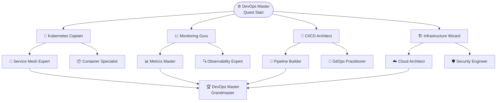

# ⚙️ DevOps Master Quest: Architect of Automation

Welcome, future DevOps Master! Embark on an epic journey to master the art of continuous delivery, infrastructure automation, and platform operations. Transform yourself into a guardian of reliability and scalability.

## 🎯 Quest Overview

**Difficulty**: ⭐⭐⭐⭐⭐ Expert  
**Duration**: 4-5 hours  
**Prerequisites**: Complete [Tutorial Quest](/docs/quests/getting-started)  
**XP Reward**: 500 XP  

:::tip 🌟 **Quest Bonus**
Complete all achievements to unlock the legendary **"DevOps Master"** title and access to exclusive infrastructure blueprints!
:::

## 🏆 Mastery Path



---

## 🚀 Achievement 1: Kubernetes Captain

Master Kubernetes orchestration, networking, and advanced workload management.

### 🎯 Learning Objectives

- Master Kubernetes networking and service mesh
- Implement advanced deployment strategies
- Configure auto-scaling and resource management
- Set up disaster recovery and backup

### 🚀 Hands-On Lab: Kubernetes Mastery

#### Step 1: Advanced Networking with Cilium

```bash
# Explore Cilium CNI features
kubectl get ciliumnetworkpolicies -A

# Check Cilium status
cilium status

# Test network connectivity
cilium connectivity test

# View Hubble observability
hubble observe --follow
```

#### Step 2: Service Mesh Configuration

```yaml
# cilium-ingress-l7-policy.yaml
apiVersion: cilium.io/v2
kind: CiliumNetworkPolicy
metadata:
  name: api-gateway-l7-policy
spec:
  endpointSelector:
    matchLabels:
      app: api-gateway
  ingress:
  - fromEndpoints:
    - matchLabels:
        app: web-frontend
    toPorts:
    - ports:
      - port: "8080"
        protocol: TCP
      rules:
        http:
        - method: "GET"
          path: "/api/v1/.*"
        - method: "POST"
          path: "/api/v1/(users|orders)"
          headers:
          - "Content-Type: application/json"
  egress:
  - toEndpoints:
    - matchLabels:
        app: user-service
    toPorts:
    - ports:
      - port: "9090"
        protocol: TCP
      rules:
        http:
        - method: "GET|POST"
          path: "/.*"
```

#### Step 3: Advanced Deployments

```yaml
# progressive-deployment.yaml
apiVersion: argoproj.io/v1alpha1
kind: Rollout
metadata:
  name: user-service-rollout
spec:
  replicas: 10
  strategy:
    canary:
      steps:
      - setWeight: 10
      - pause: {duration: 30s}
      - setWeight: 25
      - pause: {duration: 1m}
      - setWeight: 50
      - pause: {duration: 2m}
      - setWeight: 75
      - pause: {duration: 2m}
      canaryService: user-service-canary
      stableService: user-service-stable
      trafficRouting:
        istio:
          virtualService:
            name: user-service-vs
  selector:
    matchLabels:
      app: user-service
  template:
    metadata:
      labels:
        app: user-service
        version: v2
    spec:
      containers:
      - name: user-service
        image: user-service:v2.1.0
        ports:
        - containerPort: 8080
        resources:
          requests:
            memory: "256Mi"
            cpu: "200m"
          limits:
            memory: "512Mi"
            cpu: "500m"
        livenessProbe:
          httpGet:
            path: /health
            port: 8080
          initialDelaySeconds: 30
        readinessProbe:
          httpGet:
            path: /ready
            port: 8080
          initialDelaySeconds: 5
---
apiVersion: flagger.app/v1beta1
kind: Canary
metadata:
  name: user-service-canary
spec:
  targetRef:
    apiVersion: apps/v1
    kind: Deployment
    name: user-service
  progressDeadlineSeconds: 60
  service:
    port: 8080
    targetPort: 8080
  analysis:
    interval: 30s
    threshold: 5
    maxWeight: 50
    stepWeight: 10
    metrics:
    - name: request-success-rate
      thresholdRange:
        min: 99
      interval: 1m
    - name: request-duration
      thresholdRange:
        max: 500
      interval: 30s
```

#### Step 4: Resource Management & Auto-scaling

```yaml
# advanced-hpa-vpa.yaml
apiVersion: autoscaling/v2
kind: HorizontalPodAutoscaler
metadata:
  name: user-service-hpa
spec:
  scaleTargetRef:
    apiVersion: apps/v1
    kind: Deployment
    name: user-service
  minReplicas: 3
  maxReplicas: 20
  metrics:
  - type: Resource
    resource:
      name: cpu
      target:
        type: Utilization
        averageUtilization: 70
  - type: Resource
    resource:
      name: memory
      target:
        type: Utilization
        averageUtilization: 80
  - type: Pods
    pods:
      metric:
        name: kafka_consumer_lag
      target:
        type: AverageValue
        averageValue: "100"
  - type: External
    external:
      metric:
        name: prometheus_custom_metric
      target:
        type: Value
        value: "50"
  behavior:
    scaleDown:
      stabilizationWindowSeconds: 300
      policies:
      - type: Percent
        value: 50
        periodSeconds: 60
    scaleUp:
      stabilizationWindowSeconds: 60
      policies:
      - type: Percent
        value: 100
        periodSeconds: 30
---
apiVersion: autoscaling.k8s.io/v1
kind: VerticalPodAutoscaler
metadata:
  name: user-service-vpa
spec:
  targetRef:
    apiVersion: apps/v1
    kind: Deployment
    name: user-service
  updatePolicy:
    updateMode: "Auto"
  resourcePolicy:
    containerPolicies:
    - containerName: user-service
      maxAllowed:
        memory: "4Gi"
        cpu: "2000m"
      minAllowed:
        memory: "128Mi"
        cpu: "100m"
      controlledResources: ["cpu", "memory"]
      controlledValues: RequestsAndLimits
```

### 🚨 Disaster Recovery Lab

```bash
# Backup using Velero
velero backup create backup-$(date +%Y%m%d-%H%M%S) \
  --include-namespaces default,kube-system \
  --wait

# Schedule regular backups
velero schedule create daily-backup \
  --schedule="0 2 * * *" \
  --include-namespaces default \
  --ttl 720h

# Test restore procedure
velero restore create restore-$(date +%Y%m%d-%H%M%S) \
  --from-backup backup-20241201-020000 \
  --wait

# Chaos engineering with Litmus
kubectl apply -f chaos-experiments/pod-delete.yaml
kubectl apply -f chaos-experiments/network-latency.yaml
```

:::challenge 🎯 **Challenge: Multi-Cluster Deployment**
Set up a multi-cluster deployment with cross-cluster service discovery and failover using Admiral or similar tools!
:::

### ✅ Kubernetes Captain Checkpoints

- [ ] **Service Mesh**: Configure Cilium L7 policies and observability (35 XP)
- [ ] **Progressive Delivery**: Deploy with canary and blue-green strategies (40 XP)
- [ ] **Auto-scaling**: Configure advanced HPA/VPA policies (30 XP)
- [ ] **Disaster Recovery**: Set up backup and chaos engineering (30 XP)
- [ ] **Multi-tenancy**: Implement namespace isolation and RBAC (25 XP)

:::success 🎉 **Achievement Unlocked!**
**🚀 Kubernetes Captain** - You've mastered advanced Kubernetes!  
**+160 XP** | **Special Reward**: Kubernetes Architecture Patterns Guide
:::

---

## 📈 Achievement 2: Monitoring Guru

Master comprehensive observability with metrics, logs, traces, and alerting.

### 🎯 Learning Objectives

- Deploy full observability stack
- Create custom metrics and dashboards
- Set up intelligent alerting
- Implement SLIs and SLOs

### 🚀 Hands-On Lab: Observability Mastery

#### Step 1: Advanced Prometheus Configuration

```yaml
# prometheus-advanced-config.yaml
apiVersion: v1
kind: ConfigMap
metadata:
  name: prometheus-config
data:
  prometheus.yml: |
    global:
      scrape_interval: 15s
      evaluation_interval: 15s
      external_labels:
        cluster: 'production'
        region: 'us-west-2'
    
    rule_files:
      - "/etc/prometheus/rules/*.yml"
    
    alerting:
      alertmanagers:
        - static_configs:
            - targets:
              - alertmanager:9093
    
    scrape_configs:
    - job_name: 'kubernetes-apiservers'
      kubernetes_sd_configs:
      - role: endpoints
      scheme: https
      tls_config:
        ca_file: /var/run/secrets/kubernetes.io/serviceaccount/ca.crt
      bearer_token_file: /var/run/secrets/kubernetes.io/serviceaccount/token
      relabel_configs:
      - source_labels: [__meta_kubernetes_namespace, __meta_kubernetes_service_name, __meta_kubernetes_endpoint_port_name]
        action: keep
        regex: default;kubernetes;https
    
    - job_name: 'kubernetes-nodes'
      kubernetes_sd_configs:
      - role: node
      scheme: https
      tls_config:
        ca_file: /var/run/secrets/kubernetes.io/serviceaccount/ca.crt
      bearer_token_file: /var/run/secrets/kubernetes.io/serviceaccount/token
      relabel_configs:
      - action: labelmap
        regex: __meta_kubernetes_node_label_(.+)
      - target_label: __address__
        replacement: kubernetes.default.svc:443
      - source_labels: [__meta_kubernetes_node_name]
        regex: (.+)
        target_label: __metrics_path__
        replacement: /api/v1/nodes/${1}/proxy/metrics
    
    - job_name: 'kubernetes-cadvisor'
      kubernetes_sd_configs:
      - role: node
      scheme: https
      tls_config:
        ca_file: /var/run/secrets/kubernetes.io/serviceaccount/ca.crt
      bearer_token_file: /var/run/secrets/kubernetes.io/serviceaccount/token
      relabel_configs:
      - action: labelmap
        regex: __meta_kubernetes_node_label_(.+)
      - target_label: __address__
        replacement: kubernetes.default.svc:443
      - source_labels: [__meta_kubernetes_node_name]
        regex: (.+)
        target_label: __metrics_path__
        replacement: /api/v1/nodes/${1}/proxy/metrics/cadvisor
```

#### Step 2: Custom Metrics and SLIs

```python
# custom-metrics-exporter.py
from prometheus_client import Counter, Histogram, Gauge, start_http_server
from prometheus_client.core import CollectorRegistry
import time
import psutil
import requests

class ApplicationMetricsExporter:
    """Custom metrics exporter for application SLIs"""
    
    def __init__(self, port=8000):
        self.port = port
        self.registry = CollectorRegistry()
        
        # Business metrics
        self.user_registrations = Counter(
            'user_registrations_total',
            'Total user registrations',
            ['source', 'plan'],
            registry=self.registry
        )
        
        self.order_value = Histogram(
            'order_value_dollars',
            'Order values in dollars',
            ['category', 'payment_method'],
            buckets=[10, 25, 50, 100, 250, 500, 1000, 2500, 5000],
            registry=self.registry
        )
        
        # SLI metrics
        self.api_request_duration = Histogram(
            'api_request_duration_seconds',
            'API request duration in seconds',
            ['method', 'endpoint', 'status_code'],
            buckets=[0.01, 0.025, 0.05, 0.075, 0.1, 0.25, 0.5, 0.75, 1.0, 2.5, 5.0],
            registry=self.registry
        )
        
        self.error_rate = Counter(
            'api_errors_total',
            'Total API errors',
            ['service', 'endpoint', 'error_type'],
            registry=self.registry
        )
        
        self.availability_gauge = Gauge(
            'service_availability_ratio',
            'Service availability ratio',
            ['service'],
            registry=self.registry
        )
        
    def record_user_registration(self, source, plan):
        """Record user registration event"""
        self.user_registrations.labels(source=source, plan=plan).inc()
        
    def record_order(self, value, category, payment_method):
        """Record order event"""
        self.order_value.labels(
            category=category,
            payment_method=payment_method
        ).observe(value)
        
    def record_api_request(self, method, endpoint, status_code, duration):
        """Record API request"""
        self.api_request_duration.labels(
            method=method,
            endpoint=endpoint,
            status_code=status_code
        ).observe(duration)
        
        # Record error if status >= 400
        if status_code >= 400:
            error_type = 'client_error' if 400 <= status_code < 500 else 'server_error'
            self.error_rate.labels(
                service='api',
                endpoint=endpoint,
                error_type=error_type
            ).inc()
            
    def update_service_availability(self, service, availability):
        """Update service availability SLI"""
        self.availability_gauge.labels(service=service).set(availability)
        
    def start_server(self):
        """Start metrics server"""
        start_http_server(self.port, registry=self.registry)
        print(f"Metrics server started on port {self.port}")
```

#### Step 3: SLO Configuration

```yaml
# slo-configuration.yaml
apiVersion: sloth.slok.dev/v1
kind: PrometheusServiceLevel
metadata:
  name: user-service-slos
spec:
  service: "user-service"
  labels:
    team: "platform"
    env: "production"
  slos:
  - name: "requests-availability"
    objective: 99.9
    description: "99.9% of requests should succeed"
    sli:
      events:
        error_query: sum(rate(api_request_duration_seconds_count{service="user-service",status_code=~"5.."}[5m]))
        total_query: sum(rate(api_request_duration_seconds_count{service="user-service"}[5m]))
    alerting:
      name: "UserServiceHighErrorRate"
      labels:
        severity: "critical"
        team: "platform"
      annotations:
        summary: "User service error rate is above SLO"
        runbook: "https://runbooks.company.com/user-service-errors"
      page_alert:
        labels:
          severity: "critical"
  
  - name: "requests-latency"
    objective: 95.0
    description: "95% of requests should be served within 100ms"
    sli:
      events:
        error_query: sum(rate(api_request_duration_seconds_bucket{service="user-service",le="0.1"}[5m]))
        total_query: sum(rate(api_request_duration_seconds_count{service="user-service"}[5m]))
    alerting:
      name: "UserServiceHighLatency"
      labels:
        severity: "warning"
        team: "platform"
```

#### Step 4: Advanced Grafana Dashboard

```json
{
  "dashboard": {
    "title": "Enterprise Platform - Golden Signals",
    "tags": ["platform", "sli", "golden-signals"],
    "time": {
      "from": "now-1h",
      "to": "now"
    },
    "panels": [
      {
        "title": "Request Rate (RPS)",
        "type": "graph",
        "targets": [
          {
            "expr": "sum(rate(api_request_duration_seconds_count[5m])) by (service)",
            "legendFormat": "{{service}} RPS"
          }
        ],
        "yAxes": [
          {
            "label": "Requests/sec",
            "min": 0
          }
        ],
        "alert": {
          "conditions": [
            {
              "query": {
                "params": ["A", "1m", "now"]
              },
              "reducer": {
                "type": "avg"
              },
              "evaluator": {
                "params": [100],
                "type": "gt"
              }
            }
          ],
          "executionErrorState": "alerting",
          "for": "5m",
          "frequency": "10s",
          "handler": 1,
          "name": "High Request Rate",
          "noDataState": "no_data",
          "notifications": []
        }
      },
      {
        "title": "Error Rate (%)",
        "type": "singlestat",
        "targets": [
          {
            "expr": "sum(rate(api_errors_total[5m])) / sum(rate(api_request_duration_seconds_count[5m])) * 100",
            "legendFormat": "Error Rate %"
          }
        ],
        "valueMaps": [
          {
            "value": "null",
            "op": "=",
            "text": "N/A"
          }
        ],
        "thresholds": "1,5",
        "colorBackground": true
      },
      {
        "title": "Response Time Distribution",
        "type": "heatmap",
        "targets": [
          {
            "expr": "sum(rate(api_request_duration_seconds_bucket[5m])) by (le)",
            "format": "heatmap",
            "legendFormat": "{{le}}"
          }
        ]
      }
    ]
  }
}
```

### 📊 Distributed Tracing with Jaeger

```yaml
# jaeger-deployment.yaml
apiVersion: jaegertracing.io/v1
kind: Jaeger
metadata:
  name: jaeger-production
spec:
  strategy: production
  collector:
    maxReplicas: 5
    resources:
      limits:
        cpu: 500m
        memory: 512Mi
      requests:
        cpu: 256m
        memory: 256Mi
  storage:
    type: elasticsearch
    elasticsearch:
      nodeCount: 3
      redundancyPolicy: SingleRedundancy
      resources:
        requests:
          cpu: 200m
          memory: 1Gi
        limits:
          cpu: 500m
          memory: 2Gi
  query:
    replicas: 2
    resources:
      limits:
        cpu: 200m
        memory: 256Mi
```

:::challenge 🎯 **Challenge: Chaos Engineering**
Implement chaos engineering with automatic recovery validation using Litmus and custom SLO monitoring!
:::

### ✅ Monitoring Guru Checkpoints

- [ ] **Metrics Stack**: Deploy advanced Prometheus and Grafana (30 XP)
- [ ] **Custom SLIs**: Create business and technical SLIs (35 XP)
- [ ] **SLO Management**: Implement SLO monitoring and alerting (35 XP)
- [ ] **Distributed Tracing**: Set up comprehensive tracing (30 XP)
- [ ] **Alert Engineering**: Build intelligent alerting systems (30 XP)

:::success 🎉 **Achievement Unlocked!**
**📈 Monitoring Guru** - You've mastered observability!  
**+160 XP** | **Special Reward**: Observability Playbook and Dashboard Library
:::

---

## 🔄 Achievement 3: CI/CD Architect

Master continuous integration and deployment with GitOps and advanced pipeline patterns.

### 🎯 Learning Objectives

- Design multi-stage CI/CD pipelines
- Implement GitOps with ArgoCD
- Set up security scanning and compliance
- Master deployment strategies

### 🚀 Hands-On Lab: CI/CD Mastery

#### Step 1: Advanced GitHub Actions Pipeline

```yaml
# .github/workflows/enterprise-cicd.yml
name: Enterprise CI/CD Pipeline

on:
  push:
    branches: [main, develop, 'feature/*']
  pull_request:
    branches: [main]

env:
  REGISTRY: ghcr.io
  IMAGE_NAME: ${{ github.repository }}

jobs:
  security-scan:
    runs-on: ubuntu-latest
    steps:
    - name: Checkout code
      uses: actions/checkout@v4
      
    - name: Run Trivy vulnerability scanner
      uses: aquasecurity/trivy-action@master
      with:
        scan-type: 'fs'
        scan-ref: '.'
        format: 'sarif'
        output: 'trivy-results.sarif'
        
    - name: Upload Trivy scan results
      uses: github/codeql-action/upload-sarif@v2
      with:
        sarif_file: 'trivy-results.sarif'

    - name: Run Semgrep security scan
      uses: returntocorp/semgrep-action@v1
      with:
        config: >-
          p/security-audit
          p/secrets
          p/owasp-top-ten

  code-quality:
    runs-on: ubuntu-latest
    strategy:
      matrix:
        language: [typescript, rust, python]
    steps:
    - uses: actions/checkout@v4
    
    - name: Setup languages
      run: |
        case "${{ matrix.language }}" in
          typescript)
            npm install
            npm run lint
            npm run test:coverage
            ;;
          rust)
            cargo clippy -- -D warnings
            cargo test
            cargo audit
            ;;
          python)
            pip install -r requirements-dev.txt
            flake8 .
            pytest --cov=./ --cov-report=xml
            ;;
        esac

  build-and-push:
    needs: [security-scan, code-quality]
    runs-on: ubuntu-latest
    strategy:
      matrix:
        service: [api-gateway, user-service, ai-inference]
    steps:
    - name: Checkout
      uses: actions/checkout@v4

    - name: Set up Docker Buildx
      uses: docker/setup-buildx-action@v3

    - name: Log in to Container Registry
      uses: docker/login-action@v3
      with:
        registry: ${{ env.REGISTRY }}
        username: ${{ github.actor }}
        password: ${{ secrets.GITHUB_TOKEN }}

    - name: Extract metadata
      id: meta
      uses: docker/metadata-action@v5
      with:
        images: ${{ env.REGISTRY }}/${{ env.IMAGE_NAME }}/${{ matrix.service }}
        tags: |
          type=ref,event=branch
          type=ref,event=pr
          type=sha,prefix={{branch}}-
          type=raw,value=latest,enable={{is_default_branch}}

    - name: Build and push
      uses: docker/build-push-action@v5
      with:
        context: ./services/${{ matrix.service }}
        push: true
        tags: ${{ steps.meta.outputs.tags }}
        labels: ${{ steps.meta.outputs.labels }}
        cache-from: type=gha
        cache-to: type=gha,mode=max
        platforms: linux/amd64,linux/arm64

    - name: Sign container image
      run: |
        cosign sign --yes ${{ env.REGISTRY }}/${{ env.IMAGE_NAME }}/${{ matrix.service }}@${{ steps.build.outputs.digest }}

  deploy-staging:
    needs: build-and-push
    runs-on: ubuntu-latest
    if: github.ref == 'refs/heads/develop'
    environment: staging
    steps:
    - name: Update staging manifests
      run: |
        git clone https://github.com/${{ github.repository }}-gitops
        cd ${{ github.repository }}-gitops
        
        # Update image tags in staging
        yq eval '.spec.template.spec.containers[0].image = "${{ env.REGISTRY }}/${{ env.IMAGE_NAME }}/api-gateway:develop-${{ github.sha }}"' \
          -i staging/api-gateway/deployment.yaml
        
        git config user.name "CI Bot"
        git config user.email "ci@company.com"
        git add .
        git commit -m "Update staging images to ${{ github.sha }}"
        git push

  deploy-production:
    needs: build-and-push
    runs-on: ubuntu-latest
    if: github.ref == 'refs/heads/main'
    environment: production
    steps:
    - name: Create production release
      uses: actions/create-release@v1
      with:
        tag_name: v${{ github.run_number }}
        release_name: Release v${{ github.run_number }}
        draft: false
        prerelease: false

    - name: Update production manifests
      run: |
        git clone https://github.com/${{ github.repository }}-gitops
        cd ${{ github.repository }}-gitops
        
        # Update production with proper versioning
        TAG="v${{ github.run_number }}"
        
        for service in api-gateway user-service ai-inference; do
          yq eval ".spec.template.spec.containers[0].image = \"${{ env.REGISTRY }}/${{ env.IMAGE_NAME }}/${service}:${TAG}\"" \
            -i production/${service}/deployment.yaml
        done
        
        git config user.name "CI Bot"
        git config user.email "ci@company.com"
        git add .
        git commit -m "Release ${TAG}"
        git push
```

#### Step 2: ArgoCD GitOps Setup

```yaml
# argocd-application-set.yaml
apiVersion: argoproj.io/v1alpha1
kind: ApplicationSet
metadata:
  name: enterprise-platform-apps
  namespace: argocd
spec:
  generators:
  - matrix:
      generators:
      - list:
          elements:
          - env: staging
            cluster: https://staging-cluster-api
            namespace: default
          - env: production  
            cluster: https://production-cluster-api
            namespace: default
      - list:
          elements:
          - service: api-gateway
            path: api-gateway
          - service: user-service
            path: user-service
          - service: ai-inference
            path: ai-inference
  template:
    metadata:
      name: '{{service}}-{{env}}'
    spec:
      project: enterprise-platform
      source:
        repoURL: https://github.com/company/platform-gitops
        targetRevision: HEAD
        path: '{{env}}/{{path}}'
      destination:
        server: '{{cluster}}'
        namespace: '{{namespace}}'
      syncPolicy:
        automated:
          prune: true
          selfHeal: true
          allowEmpty: false
        syncOptions:
        - CreateNamespace=true
        - PrunePropagationPolicy=foreground
        - PruneLast=true
        retry:
          limit: 5
          backoff:
            duration: 5s
            factor: 2
            maxDuration: 3m
      revisionHistoryLimit: 10
---
apiVersion: argoproj.io/v1alpha1
kind: AppProject
metadata:
  name: enterprise-platform
  namespace: argocd
spec:
  description: Enterprise Platform Applications
  sourceRepos:
  - 'https://github.com/company/platform-gitops'
  destinations:
  - namespace: '*'
    server: '*'
  clusterResourceWhitelist:
  - group: ''
    kind: Namespace
  - group: apps
    kind: Deployment
  - group: ''
    kind: Service
  namespaceResourceWhitelist:
  - group: ''
    kind: ConfigMap
  - group: ''
    kind: Secret
  - group: apps
    kind: Deployment
  - group: ''
    kind: Service
  roles:
  - name: admin
    policies:
    - p, proj:enterprise-platform:admin, applications, *, enterprise-platform/*, allow
    - p, proj:enterprise-platform:admin, repositories, *, *, allow
    groups:
    - company:platform-team
```

#### Step 3: Progressive Delivery with Flagger

```yaml
# flagger-canary.yaml
apiVersion: flagger.app/v1beta1
kind: Canary
metadata:
  name: user-service-canary
  namespace: default
spec:
  targetRef:
    apiVersion: apps/v1
    kind: Deployment
    name: user-service
  progressDeadlineSeconds: 60
  service:
    port: 8080
    targetPort: 8080
    gateways:
    - istio-gateway
    hosts:
    - api.company.com
    trafficPolicy:
      tls:
        mode: ISTIO_MUTUAL
  analysis:
    interval: 1m
    threshold: 5
    maxWeight: 50
    stepWeight: 10
    metrics:
    - name: request-success-rate
      thresholdRange:
        min: 99
      interval: 1m
    - name: request-duration
      thresholdRange:
        max: 500
      interval: 30s
    - name: "custom-metric"
      thresholdRange:
        min: 0.95
      interval: 1m
      query: |
        (
          sum(
            rate(
              http_requests_total{
                kubernetes_namespace="default",
                kubernetes_pod_name=~"user-service-.*"
              }[1m]
            )
          ) - 
          sum(
            rate(
              http_requests_total{
                kubernetes_namespace="default",
                kubernetes_pod_name=~"user-service-.*",
                code=~"5.."
              }[1m]
            )
          )
        ) / 
        sum(
          rate(
            http_requests_total{
              kubernetes_namespace="default",
              kubernetes_pod_name=~"user-service-.*"
            }[1m]
          )
        )
    webhooks:
    - name: "start-load-test"
      url: http://loadtester.default/
      timeout: 5s
      metadata:
        cmd: "hey -z 10m -q 10 -c 2 http://user-service-canary.default:8080/"
    - name: "slack-notification"
      url: https://hooks.slack.com/services/YOUR/SLACK/WEBHOOK
      timeout: 5s
      metadata:
        text: "Canary deployment started for user-service"
  analysis:
    alerts:
    - name: "slack-alert"
      severity: error
      providerRef:
        name: slack
        namespace: flagger-system
```

#### Step 4: Policy as Code with OPA

```yaml
# opa-pipeline-policies.yaml
apiVersion: v1
kind: ConfigMap
metadata:
  name: pipeline-policies
data:
  deployment-policy.rego: |
    package kubernetes.admission
    
    import data.kubernetes.namespaces
    
    deny[msg] {
      input.request.kind.kind == "Deployment"
      input.request.object.spec.template.spec.containers[_].image
      not starts_with(input.request.object.spec.template.spec.containers[_].image, "ghcr.io/company/")
      msg := "All images must come from approved registry ghcr.io/company/"
    }
    
    deny[msg] {
      input.request.kind.kind == "Deployment"
      container := input.request.object.spec.template.spec.containers[_]
      not container.resources.requests
      msg := sprintf("Container %s must specify resource requests", [container.name])
    }
    
    deny[msg] {
      input.request.kind.kind == "Deployment"
      container := input.request.object.spec.template.spec.containers[_]
      not container.livenessProbe
      msg := sprintf("Container %s must have a liveness probe", [container.name])
    }
    
    deny[msg] {
      input.request.kind.kind == "Deployment"
      container := input.request.object.spec.template.spec.containers[_]
      not container.readinessProbe
      msg := sprintf("Container %s must have a readiness probe", [container.name])
    }
  
  security-policy.rego: |
    package kubernetes.admission
    
    deny[msg] {
      input.request.kind.kind == "Deployment"
      input.request.object.spec.template.spec.securityContext.runAsRoot == true
      msg := "Containers cannot run as root"
    }
    
    deny[msg] {
      input.request.kind.kind == "Deployment"
      container := input.request.object.spec.template.spec.containers[_]
      container.securityContext.privileged == true
      msg := sprintf("Container %s cannot run in privileged mode", [container.name])
    }
```

:::challenge 🎯 **Challenge: Multi-Cloud CI/CD**
Design a CI/CD pipeline that deploys to multiple cloud providers with environment-specific configurations!
:::

### ✅ CI/CD Architect Checkpoints

- [ ] **Pipeline Design**: Create multi-stage CI/CD pipeline (35 XP)
- [ ] **GitOps Implementation**: Set up ArgoCD with ApplicationSets (35 XP)
- [ ] **Progressive Delivery**: Implement canary deployments (35 XP)
- [ ] **Security Integration**: Add security scanning and policies (30 XP)
- [ ] **Pipeline Monitoring**: Set up CI/CD observability (25 XP)

:::success 🎉 **Achievement Unlocked!**
**🔄 CI/CD Architect** - You've mastered continuous delivery!  
**+160 XP** | **Special Reward**: GitOps Patterns and Pipeline Templates
:::

---

## 🏗️ Achievement 4: Infrastructure Wizard

Master infrastructure as code, cloud architecture, and platform automation.

### 🎯 Learning Objectives

- Design scalable cloud infrastructure
- Implement Infrastructure as Code
- Master Terraform and Helm patterns
- Set up multi-environment management

### 🚀 Hands-On Lab: Infrastructure Mastery

#### Step 1: Advanced Terraform Architecture

```hcl
# terraform/modules/kubernetes-platform/main.tf
terraform {
  required_version = ">= 1.5"
  required_providers {
    aws = {
      source  = "hashicorp/aws"
      version = "~> 5.0"
    }
    kubernetes = {
      source  = "hashicorp/kubernetes"
      version = "~> 2.20"
    }
    helm = {
      source  = "hashicorp/helm"
      version = "~> 2.10"
    }
  }
}

locals {
  common_tags = {
    Environment = var.environment
    Project     = var.project_name
    ManagedBy   = "terraform"
    Team        = var.team
  }
}

# EKS Cluster with advanced configuration
module "eks" {
  source  = "terraform-aws-modules/eks/aws"
  version = "~> 19.0"

  cluster_name    = "${var.project_name}-${var.environment}"
  cluster_version = var.kubernetes_version

  cluster_endpoint_config = {
    private_access = true
    public_access  = true
    public_access_cidrs = var.allowed_cidr_blocks
  }

  # Encryption at rest
  cluster_encryption_config = {
    provider_key_arn = aws_kms_key.eks.arn
    resources        = ["secrets"]
  }

  vpc_id     = var.vpc_id
  subnet_ids = var.private_subnet_ids

  # Managed node groups with different instance types
  eks_managed_node_groups = {
    general = {
      name = "general"
      
      instance_types = ["m6i.large", "m5.large"]
      capacity_type  = "SPOT"
      
      min_size     = 2
      max_size     = 10
      desired_size = 3

      labels = {
        workload = "general"
      }
      
      taints = []
    }

    compute_optimized = {
      name = "compute-optimized"
      
      instance_types = ["c6i.xlarge", "c5.xlarge"]
      capacity_type  = "ON_DEMAND"
      
      min_size     = 0
      max_size     = 5
      desired_size = 1

      labels = {
        workload = "cpu-intensive"
      }
      
      taints = [
        {
          key    = "workload"
          value  = "cpu-intensive"
          effect = "NO_SCHEDULE"
        }
      ]
    }

    gpu = {
      name = "gpu"
      
      instance_types = ["g4dn.xlarge"]
      capacity_type  = "ON_DEMAND"
      
      min_size     = 0
      max_size     = 3
      desired_size = 0

      labels = {
        workload = "gpu"
        "nvidia.com/gpu" = "true"
      }
      
      taints = [
        {
          key    = "nvidia.com/gpu"
          value  = "true"
          effect = "NO_SCHEDULE"
        }
      ]
    }
  }

  # Security groups
  node_security_group_additional_rules = {
    ingress_self_all = {
      description = "Node to node all ports/protocols"
      protocol    = "-1"
      from_port   = 0
      to_port     = 65535
      type        = "ingress"
      self        = true
    }
  }

  tags = local.common_tags
}

# Install essential platform components
resource "helm_release" "cilium" {
  name       = "cilium"
  repository = "https://helm.cilium.io/"
  chart      = "cilium"
  namespace  = "kube-system"
  version    = "1.14.5"

  set {
    name  = "operator.replicas"
    value = "2"
  }

  set {
    name  = "hubble.relay.enabled"
    value = "true"
  }

  set {
    name  = "hubble.ui.enabled"
    value = "true"
  }

  set {
    name  = "cluster.name"
    value = module.eks.cluster_name
  }

  depends_on = [module.eks]
}

# ArgoCD for GitOps
resource "helm_release" "argocd" {
  name       = "argocd"
  repository = "https://argoproj.github.io/argo-helm"
  chart      = "argo-cd"
  namespace  = "argocd"
  version    = "5.51.6"

  create_namespace = true

  values = [
    templatefile("${path.module}/values/argocd-values.yaml", {
      domain = var.domain_name
      environment = var.environment
    })
  ]

  depends_on = [helm_release.cilium]
}
```

#### Step 2: Multi-Environment Configuration

```hcl
# environments/production/main.tf
terraform {
  backend "s3" {
    bucket         = "company-terraform-state"
    key            = "platform/production/terraform.tfstate"
    region         = "us-west-2"
    dynamodb_table = "terraform-lock-table"
    encrypt        = true
  }
}

module "networking" {
  source = "../../modules/networking"

  environment      = "production"
  vpc_cidr         = "10.0.0.0/16"
  availability_zones = ["us-west-2a", "us-west-2b", "us-west-2c"]
  
  enable_nat_gateway = true
  enable_vpn_gateway = false
  enable_dns_hostnames = true
  enable_dns_support = true

  tags = local.common_tags
}

module "kubernetes_platform" {
  source = "../../modules/kubernetes-platform"

  project_name       = "enterprise-ai-platform"
  environment        = "production"
  kubernetes_version = "1.28"
  team              = "platform"

  vpc_id              = module.networking.vpc_id
  private_subnet_ids  = module.networking.private_subnet_ids
  public_subnet_ids   = module.networking.public_subnet_ids
  
  allowed_cidr_blocks = [
    "10.0.0.0/8",      # Internal
    "192.168.1.0/24"   # Office
  ]

  node_groups = {
    general = {
      instance_types = ["m6i.xlarge", "m5.xlarge"]
      capacity_type  = "SPOT"
      min_size      = 3
      max_size      = 20
      desired_size  = 5
    }
    
    ai_workload = {
      instance_types = ["g4dn.2xlarge"]
      capacity_type  = "ON_DEMAND"
      min_size      = 0
      max_size      = 5
      desired_size  = 0
    }
  }
}

module "observability" {
  source = "../../modules/observability"

  cluster_name = module.kubernetes_platform.cluster_name
  environment  = "production"
  
  prometheus_storage_size = "100Gi"
  grafana_storage_size   = "50Gi"
  
  enable_alertmanager = true
  enable_jaeger      = true
  
  slack_webhook_url = var.slack_webhook_url
  pagerduty_key    = var.pagerduty_key
}

# Production-specific security hardening
resource "kubernetes_network_policy" "default_deny_all" {
  metadata {
    name      = "default-deny-all"
    namespace = "default"
  }

  spec {
    pod_selector {}
    policy_types = ["Ingress", "Egress"]
  }
}

# Production secrets management
resource "aws_secretsmanager_secret" "database_credentials" {
  name        = "production/database/credentials"
  description = "Database credentials for production"
  
  replica {
    region = "us-east-1"
  }
  
  tags = local.common_tags
}
```

#### Step 3: Advanced Helm Charts

```yaml
# helm/charts/microservice-template/Chart.yaml
apiVersion: v2
name: microservice-template
description: Enterprise microservice Helm chart template
type: application
version: 1.0.0
appVersion: "1.0.0"

dependencies:
- name: postgresql
  version: "12.1.9"
  repository: "https://charts.bitnami.com/bitnami"
  condition: postgresql.enabled
- name: redis
  version: "17.3.7"
  repository: "https://charts.bitnami.com/bitnami"
  condition: redis.enabled

---
# helm/charts/microservice-template/values.yaml
# Global settings
global:
  imageRegistry: "ghcr.io"
  imagePullSecrets: []
  storageClass: "gp3-ssd"

# Application configuration
app:
  name: microservice
  version: "1.0.0"
  port: 8080
  healthCheckPath: "/health"
  
image:
  repository: company/microservice
  tag: ""
  pullPolicy: IfNotPresent

# Deployment configuration
replicaCount: 3

resources:
  limits:
    cpu: 500m
    memory: 512Mi
  requests:
    cpu: 100m
    memory: 128Mi

autoscaling:
  enabled: true
  minReplicas: 3
  maxReplicas: 20
  targetCPUUtilizationPercentage: 70
  targetMemoryUtilizationPercentage: 80

# Service configuration
service:
  type: ClusterIP
  port: 80
  targetPort: 8080

# Ingress configuration
ingress:
  enabled: true
  className: "nginx"
  annotations:
    cert-manager.io/cluster-issuer: "letsencrypt-prod"
    nginx.ingress.kubernetes.io/rate-limit: "1000"
    nginx.ingress.kubernetes.io/rate-limit-window: "1m"
  hosts:
    - host: api.company.com
      paths:
        - path: /
          pathType: Prefix
  tls:
    - secretName: api-tls
      hosts:
        - api.company.com

# Security configuration
securityContext:
  enabled: true
  runAsNonRoot: true
  runAsUser: 1000
  runAsGroup: 1000
  fsGroup: 1000
  capabilities:
    drop:
      - ALL
  readOnlyRootFilesystem: true

# Monitoring
serviceMonitor:
  enabled: true
  path: /metrics
  port: http
  interval: 30s

# Database dependency
postgresql:
  enabled: true
  auth:
    postgresPassword: "changeMe"
    database: "app"
  primary:
    persistence:
      size: 20Gi
      storageClass: "gp3-ssd"

# Cache dependency  
redis:
  enabled: true
  auth:
    enabled: true
    password: "changeMe"
  master:
    persistence:
      size: 8Gi
      storageClass: "gp3-ssd"
```

#### Step 4: Platform Automation

```python
# scripts/platform-automation.py
#!/usr/bin/env python3

import subprocess
import yaml
import json
import argparse
from pathlib import Path
import logging
from typing import Dict, List

class PlatformAutomation:
    """Automate platform operations"""
    
    def __init__(self, config_path: str):
        self.config = self.load_config(config_path)
        self.setup_logging()
        
    def load_config(self, config_path: str) -> Dict:
        """Load platform configuration"""
        with open(config_path, 'r') as f:
            return yaml.safe_load(f)
            
    def setup_logging(self):
        """Setup logging"""
        logging.basicConfig(
            level=logging.INFO,
            format='%(asctime)s - %(levelname)s - %(message)s'
        )
        self.logger = logging.getLogger(__name__)
        
    def terraform_plan(self, environment: str) -> bool:
        """Run terraform plan for environment"""
        try:
            cmd = [
                "terraform", "plan",
                f"-var-file=environments/{environment}.tfvars",
                "-out=tfplan"
            ]
            
            result = subprocess.run(
                cmd,
                cwd=f"terraform/environments/{environment}",
                capture_output=True,
                text=True,
                check=True
            )
            
            self.logger.info(f"Terraform plan successful for {environment}")
            return True
            
        except subprocess.CalledProcessError as e:
            self.logger.error(f"Terraform plan failed: {e.stderr}")
            return False
            
    def terraform_apply(self, environment: str) -> bool:
        """Apply terraform changes"""
        try:
            cmd = ["terraform", "apply", "-auto-approve", "tfplan"]
            
            result = subprocess.run(
                cmd,
                cwd=f"terraform/environments/{environment}",
                capture_output=True,
                text=True,
                check=True
            )
            
            self.logger.info(f"Terraform apply successful for {environment}")
            return True
            
        except subprocess.CalledProcessError as e:
            self.logger.error(f"Terraform apply failed: {e.stderr}")
            return False
            
    def deploy_platform_apps(self, environment: str) -> bool:
        """Deploy platform applications via ArgoCD"""
        try:
            # Create ArgoCD applications
            apps = self.config['environments'][environment]['applications']
            
            for app in apps:
                app_manifest = self.generate_argocd_app(app, environment)
                
                cmd = ["kubectl", "apply", "-f", "-"]
                result = subprocess.run(
                    cmd,
                    input=yaml.dump(app_manifest),
                    text=True,
                    capture_output=True,
                    check=True
                )
                
            self.logger.info(f"Platform apps deployed to {environment}")
            return True
            
        except Exception as e:
            self.logger.error(f"Failed to deploy platform apps: {str(e)}")
            return False
            
    def generate_argocd_app(self, app: Dict, environment: str) -> Dict:
        """Generate ArgoCD application manifest"""
        return {
            "apiVersion": "argoproj.io/v1alpha1",
            "kind": "Application",
            "metadata": {
                "name": f"{app['name']}-{environment}",
                "namespace": "argocd"
            },
            "spec": {
                "project": "default",
                "source": {
                    "repoURL": app['repoURL'],
                    "path": f"environments/{environment}",
                    "targetRevision": app.get('targetRevision', 'HEAD')
                },
                "destination": {
                    "server": "https://kubernetes.default.svc",
                    "namespace": app.get('namespace', 'default')
                },
                "syncPolicy": {
                    "automated": {
                        "prune": True,
                        "selfHeal": True
                    },
                    "syncOptions": [
                        "CreateNamespace=true"
                    ]
                }
            }
        }
        
    def run_smoke_tests(self, environment: str) -> bool:
        """Run smoke tests after deployment"""
        try:
            tests = self.config['environments'][environment]['smoke_tests']
            
            for test in tests:
                self.logger.info(f"Running smoke test: {test['name']}")
                
                if test['type'] == 'http':
                    result = subprocess.run([
                        "curl", "-f", "-s", test['url']
                    ], check=True)
                elif test['type'] == 'kubectl':
                    result = subprocess.run([
                        "kubectl", "wait", "--for=condition=ready",
                        f"pod/{test['pod']}", f"--timeout={test['timeout']}"
                    ], check=True)
                    
            self.logger.info(f"All smoke tests passed for {environment}")
            return True
            
        except Exception as e:
            self.logger.error(f"Smoke tests failed: {str(e)}")
            return False

def main():
    parser = argparse.ArgumentParser(description='Platform automation tool')
    parser.add_argument('--config', required=True, help='Config file path')
    parser.add_argument('--environment', required=True, help='Environment to deploy')
    parser.add_argument('--action', required=True, choices=['plan', 'apply', 'deploy', 'test', 'all'])
    
    args = parser.parse_args()
    
    automation = PlatformAutomation(args.config)
    
    if args.action in ['plan', 'all']:
        automation.terraform_plan(args.environment)
        
    if args.action in ['apply', 'all']:
        automation.terraform_apply(args.environment)
        
    if args.action in ['deploy', 'all']:
        automation.deploy_platform_apps(args.environment)
        
    if args.action in ['test', 'all']:
        automation.run_smoke_tests(args.environment)

if __name__ == "__main__":
    main()
```

:::challenge 🎯 **Challenge: Multi-Cloud Infrastructure**
Design infrastructure that spans multiple cloud providers with automated failover and consistent configuration!
:::

### ✅ Infrastructure Wizard Checkpoints

- [ ] **IaC Mastery**: Design advanced Terraform modules (40 XP)
- [ ] **Multi-Environment**: Configure staging and production (30 XP)
- [ ] **Helm Expertise**: Create reusable Helm chart templates (35 XP)
- [ ] **Automation**: Build platform automation scripts (30 XP)
- [ ] **Cloud Architecture**: Design scalable cloud infrastructure (25 XP)

:::success 🎉 **Achievement Unlocked!**
**🏗️ Infrastructure Wizard** - You've mastered infrastructure automation!  
**+160 XP** | **Special Reward**: Infrastructure Blueprints and Terraform Modules
:::

---

## 🏆 Quest Complete: DevOps Master Grandmaster!

**Congratulations, DevOps Master Grandmaster!** You've conquered the ultimate challenge of platform engineering and operational excellence!

### 🎉 Final Rewards Summary

- **Total XP Earned**: 640+ XP
- **New Level**: Platform Engineering Expert (Level 7)
- **Grandmaster Achievement**: ⚙️ **DevOps Master**
- **Special Items**: Complete platform blueprints, automation toolkit, operational playbooks

### 🏅 DevOps Master Certificate

```
🏆 CERTIFICATE OF GRANDMASTERY 🏆

This certifies that you have successfully completed the
DEVOPS MASTER QUEST

and have demonstrated exceptional mastery in:
✅ Advanced Kubernetes Orchestration & Service Mesh
✅ Comprehensive Observability & SLO Management
✅ Enterprise CI/CD & GitOps Implementation
✅ Infrastructure as Code & Cloud Architecture
✅ Platform Automation & Operational Excellence

Awarded on: [Date]
Quest Completion ID: DM-{timestamp}

You are now qualified to architect and lead
enterprise platform engineering initiatives!
```

### 🚀 Exclusive DevOps Master Rewards

Unlock access to:
- **🏗️ Platform Blueprints**: Complete infrastructure templates
- **⚙️ Automation Toolkit**: Advanced platform automation scripts
- **📊 Operational Dashboards**: Comprehensive monitoring solutions
- **🎓 Mentor Status**: Guide other platform engineering adventurers
- **🌟 DevOps Community**: Join elite DevOps Master network
- **🔧 Custom Tools**: Exclusive platform engineering utilities

### 🔮 Next Level Adventures

Ready to push the boundaries of platform engineering?

1. **🌐 Multi-Cloud Mastery** - Design global, multi-cloud platforms
2. **🤖 AI-Powered Operations** - Implement AIOps and intelligent automation
3. **🔒 Zero-Trust Architecture** - Build comprehensive zero-trust platforms
4. **🚀 Edge Computing** - Extend platforms to edge and IoT devices

### ⚙️ DevOps Resources

- **📚 Platform Wiki**: `/docs/platform/overview`
- **🛠️ Tool Repository**: Pre-configured platform tools
- **📊 Reference Architectures**: Proven platform designs
- **🎯 Best Practices**: Operational excellence guidelines
- **🔍 Troubleshooting**: Advanced debugging techniques

:::tip 🎖️ **DevOps Master Badge**
Add this prestigious badge to your professional profile:
```
⚙️ Enterprise Platform DevOps Master
Certified in Kubernetes, CI/CD, IaC, and Observability
```
:::

---

## 🌟 DevOps Master Community

Join the elite DevOps Master community:

- **⚙️ DevOps Discord**: [#devops-masters](https://discord.gg/devops-masters)
- **🏗️ Architecture Forum**: Share platform designs and patterns
- **🎥 Tech Talks**: Monthly platform engineering presentations
- **🏆 Platform Challenges**: Advanced engineering competitions
- **📚 Research Group**: Collaborate on platform innovations

### 💡 Share Your Mastery

Help other adventurers by sharing:
- Your most complex platform challenge and solution
- Best practices for scaling Kubernetes in production
- Innovative observability patterns you've discovered
- Automation scripts that saved significant time

### 🎯 Special Recognition

**You've earned the right to display the official DevOps Master Grandmaster badge:**

```
    ⚙️ DEVOPS MASTER GRANDMASTER ⚙️
   ========================================
   🚀 Kubernetes Architecture Expert
   📈 Observability & SLO Specialist
   🔄 CI/CD & GitOps Practitioner  
   🏗️ Infrastructure Automation Wizard
   ========================================
        Enterprise AI Platform
```

### 🌟 Lifetime Achievements

As a DevOps Master Grandmaster, you've earned these lifetime achievements:

- **🏆 Platform Architect**: Design enterprise-grade platforms
- **📊 Observability Expert**: Implement comprehensive monitoring
- **🔄 Automation Wizard**: Build self-healing, automated systems
- **🚀 Scalability Master**: Handle massive scale with confidence
- **🛡️ Reliability Guardian**: Ensure 99.9%+ uptime
- **🎓 Knowledge Sharer**: Mentor the next generation

Remember: **Great platforms enable great products, and you're now equipped to build both!** ⚙️✨

---

## 🎉 Welcome to the Elite!

**You are now part of an exclusive group of platform engineering experts who have mastered the complete DevOps lifecycle. Your journey doesn't end here - it's just the beginning of your role as a platform engineering leader!**

Continue pushing the boundaries of what's possible in platform engineering. The future is automated, observable, and scalable - and you're now equipped to build it! 🌟⚙️