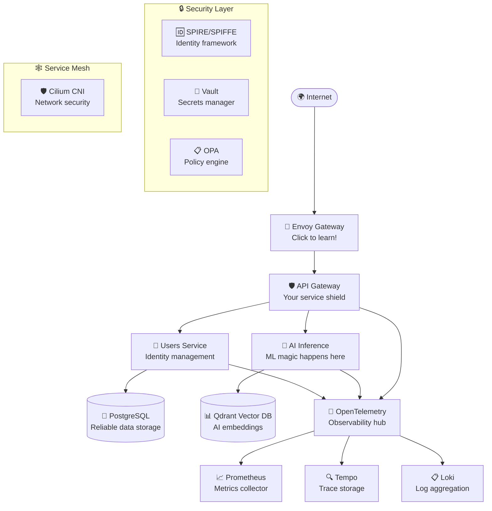

# 📚 Tutorial Quest: First Steps to Mastery

Welcome to your first quest, adventurer! This tutorial will guide you through the essential skills needed to become a true Enterprise AI Platform expert.

## 🎯 Quest Objectives

Complete all checkpoints to earn **150 XP** and unlock the **"Quick Learner"** achievement!

### 📋 Progress Checklist

- [ ] **Checkpoint 1**: Set up your development environment (25 XP)
- [ ] **Checkpoint 2**: Deploy your first service (30 XP) 
- [ ] **Checkpoint 3**: Explore the architecture (20 XP)
- [ ] **Checkpoint 4**: Make your first API call (25 XP)
- [ ] **Checkpoint 5**: View observability data (25 XP)
- [ ] **Checkpoint 6**: Run security checks (25 XP)

:::info 🗺️ **Quest Navigation**
This is a **Linear Quest** - complete checkpoints in order for the best experience!
:::

## 🏁 Checkpoint 1: Environment Setup

Time to prepare your adventuring gear! Let's set up your development environment.

### Prerequisites Check

Before we begin, make sure you have these tools in your inventory:

```bash
# 🔧 Essential Tools (Required for adventure!)
docker --version
make --version  
kubectl version --client
helm version
terraform --version

# 🛡️ Security Tools (For advanced quests)
cosign version
sops --version
age --version

# 💻 Language Runtimes (Choose your weapons!)
node --version    # Node.js LTS
go version       # Go 1.22+
rustc --version  # Rust stable
python --version # Python 3.11+
```

:::tip 💡 **Pro Tip**
Missing tools? No worries! Each tool installation guide is in the [Prerequisites Guide](/docs/getting-started/prerequisites).
:::

### 🚀 Try It! - Initialize Your Workspace

Ready to start? Run this magical incantation:

```bash
# Clone your adventure map
git clone https://github.com/your-org/enterprise-ai-platform
cd enterprise-ai-platform

# Cast the initialization spell
make init-dev

# Gather your dependencies  
make deps
```

:::success 🎉 **Checkpoint 1 Complete!**
**+25 XP** | You've successfully set up your development environment!

**Achievement Unlocked**: 🛠️ **"Tool Master"** - Set up a complete dev environment
:::

---

## 🏗️ Checkpoint 2: Your First Deployment

Time to bring your platform to life! We'll deploy the infrastructure step by step.

### Infrastructure Deployment

```bash
# Navigate to the infrastructure realm
cd infra/terraform/envs/dev

# Initialize the terraform spell book
terraform init

# Preview what magic will happen
terraform plan

# Cast the infrastructure creation spell
terraform apply
```

:::tip 🔥 **Battle Tip**
Watch the output carefully! Each green line means successful resource creation. If you see red errors, check the troubleshooting guide.
:::

### Platform Services

```bash
# Return to base camp
cd ../../../../

# Deploy the kubernetes platform
make platform-apply

# Set up the security wards
make vault-bootstrap
make keycloak-bootstrap
```

:::success 🎉 **Checkpoint 2 Complete!**
**+30 XP** | Your platform infrastructure is alive!

**Achievement Unlocked**: 🏗️ **"Foundation Builder"** - Deploy complete infrastructure
:::

---

## 🔍 Checkpoint 3: Explore Your Kingdom

Let's explore what you've built! Understanding the architecture earns wisdom points.

### Interactive Architecture Tour

Click on each component below to learn more:



### 🕵️ System Health Check

Run these commands to explore your deployed kingdom:

```bash
# View your realm's inhabitants (pods)
kubectl get pods

# Check the gateway defenses
kubectl get gateways

# Inspect the route paths
kubectl get httproutes

# Test the health of your services
kubectl port-forward svc/api-gateway 8080:80
curl http://localhost:8080/healthz
```

:::info 💫 **Discovery Bonus**
Each component you explore adds to your understanding! Try clicking on different parts of the architecture diagram above.
:::

:::success 🎉 **Checkpoint 3 Complete!**
**+20 XP** | You've mapped your platform architecture!

**Achievement Unlocked**: 🗺️ **"Explorer"** - Discovered all platform components
:::

---

## 📞 Checkpoint 4: Your First API Quest

Time to communicate with your platform! Making API calls is how you interact with your services.

### 🧪 API Testing Lab

Let's test different endpoints and see what happens:

```bash
# Test the health endpoint
curl -X GET http://localhost:8080/healthz

# Try the users API
curl -X GET http://localhost:8080/api/v1/users \
  -H "Content-Type: application/json"

# Test AI inference (if available)
curl -X POST http://localhost:8080/api/v1/ai/inference \
  -H "Content-Type: application/json" \
  -d '{"text": "Hello, AI!"}'
```

:::challenge 🎯 **Challenge Mode**
Try creating a new user with a POST request! Hint: Check the API documentation for the required fields.
:::

### 📊 Response Analysis

When you make API calls, look for these important elements:

- **Status Code**: 200 = Success, 404 = Not Found, 500 = Server Error
- **Response Headers**: Contains metadata about the response
- **Response Body**: The actual data returned
- **Response Time**: How fast your API responds

:::success 🎉 **Checkpoint 4 Complete!**
**+25 XP** | You've mastered basic API communication!

**Achievement Unlocked**: 📞 **"API Whisperer"** - Successfully made API calls
:::

---

## 📊 Checkpoint 5: Observability Dashboard

Every good adventurer needs situational awareness! Let's explore your platform's observability features.

### 🔍 Monitoring Your Realm

Access your observability tools:

```bash
# Access Grafana dashboard
kubectl port-forward svc/grafana 3000:3000
# Open http://localhost:3000 in browser

# Access Jaeger for tracing
kubectl port-forward svc/jaeger 16686:16686  
# Open http://localhost:16686 in browser

# View Prometheus metrics
kubectl port-forward svc/prometheus 9090:9090
# Open http://localhost:9090 in browser
```

### 📈 Dashboard Tour

In each tool, look for these key metrics:

**Grafana Dashboards:**
- 🚀 **Application Performance**: Request rates, response times, error rates
- 🖥️ **Infrastructure Health**: CPU, memory, disk usage
- 🔒 **Security Events**: Authentication attempts, policy violations

**Jaeger Traces:**
- 🔍 **Request Journey**: How requests flow through your services
- ⚡ **Performance Bottlenecks**: Which services are slow
- 🐛 **Error Tracking**: Where failures occur

**Prometheus Metrics:**
- 📊 **Custom Metrics**: Business-specific measurements
- 🎯 **SLI Tracking**: Service Level Indicators
- 📈 **Trend Analysis**: Performance over time

:::tip 🧠 **Learning Bonus**
Spend 5 minutes exploring each dashboard. You'll gain insights into how production systems are monitored!
:::

:::success 🎉 **Checkpoint 5 Complete!**
**+25 XP** | You've mastered platform observability!

**Achievement Unlocked**: 📊 **"Metrics Master"** - Explored all monitoring tools
:::

---

## 🛡️ Checkpoint 6: Security Validation

The final checkpoint! Let's ensure your platform is secure and ready for battle.

### 🔍 Security Audit

Run these security checks:

```bash
# Check SPIRE identities
kubectl get spiffeids

# Verify Vault status
kubectl exec vault-0 -- vault status

# Test policy enforcement
kubectl get networkpolicies
kubectl get ciliumnetworkpolicies

# Scan for vulnerabilities (if cosign is available)
make security-scan
```

### 🔐 Security Features Verification

Verify these security features are working:

- [ ] **mTLS Communication**: Services communicate securely
- [ ] **Identity Verification**: SPIFFE identities are issued
- [ ] **Secret Management**: Vault is storing secrets safely  
- [ ] **Network Policies**: Traffic is properly restricted
- [ ] **Image Signing**: Container images are signed and verified

:::warning ⚠️ **Security Alert**
In production, always run full security scans and penetration testing before going live!
:::

:::success 🎉 **Checkpoint 6 Complete!**
**+25 XP** | Your platform is secure and battle-ready!

**Achievement Unlocked**: 🛡️ **"Security Guardian"** - Validated all security features
:::

---

## 🏆 Quest Complete! 

**Congratulations, Platform Adventurer!** You've completed the Tutorial Quest!

### 🎉 Final Rewards

- **Total XP Earned**: 150 XP
- **Level**: Apprentice Developer (Level 2)
- **New Achievements**: 🛠️ Tool Master, 🏗️ Foundation Builder, 🗺️ Explorer, 📞 API Whisperer, 📊 Metrics Master, 🛡️ Security Guardian

### 🚀 Next Adventures

You're now ready for advanced quests! Choose your specialization:

1. **[🛡️ Security Champion Quest](/docs/quests/security-champion)** - Master identity, secrets, and policies
2. **[🤖 AI Explorer Quest](/docs/quests/ai-explorer)** - Dive deep into ML pipelines and vector databases  
3. **[⚙️ DevOps Master Quest](/docs/quests/devops-master)** - Become a Kubernetes and observability expert

:::info 🎓 **Graduation Badge**
You've earned the **"Platform Graduate"** badge! Display it proudly in your developer profile.
:::

---

## 💬 Need Help?

Stuck on a quest? Here's how to get assistance:

- 🐛 **Bug Reports**: [GitHub Issues](https://github.com/your-org/enterprise-ai-platform/issues)
- 💬 **Community**: [Discord Server](https://discord.gg/enterprise-ai-platform)
- 📚 **Documentation**: [Full Docs](/docs/intro)
- 🎥 **Video Guides**: [YouTube Channel](https://youtube.com/enterprise-ai-platform)

Happy adventuring! 🎮✨